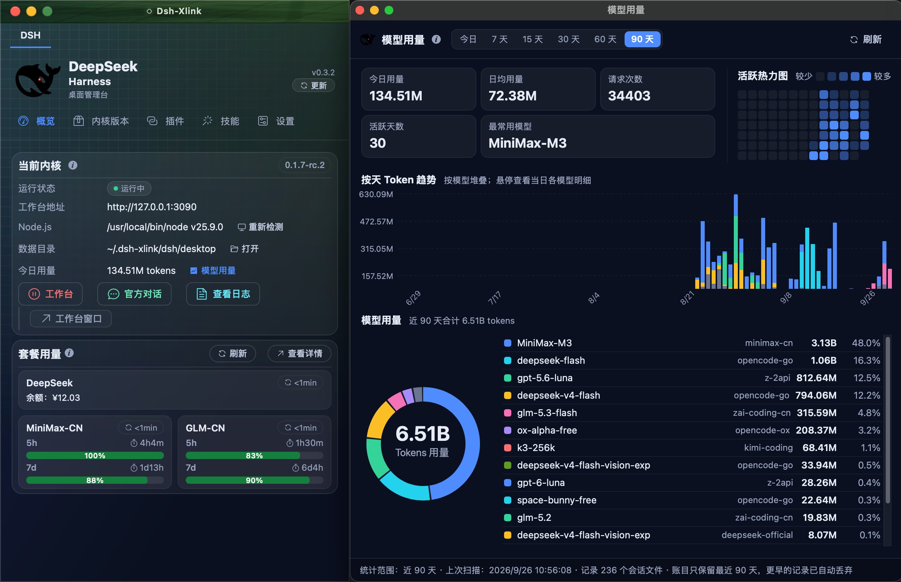

# DeepSeek Harness 桌面端（dsh-xlink）

[](https://github.com/July-X/dsh-xlink/releases/latest)

[Tauri v2](https://tauri.app/zh-cn/) 写的多内核桌面外壳，把不同内核的 Web UI 装到桌面上——目前支持 DeepSeek Harness，后续会加 mcode 等。每个内核按实例运行、互不干扰。外壳只管准备路径与环境变量、装扩展、看护生命周期，内核怎么跑由内核自己决定。跟着官方 [`deepseek-ai/deepseek-harness`](https://github.com/deepseek-ai/deepseek-harness) 的 `dsh-v*` tag 一键安装、切换、删除。

仓库根目录就是桌面项目本体（独立 pnpm 根、独立的 Tauri / Vue / 文档 / 发布配置）。

GitHub 仓库：[July-X/dsh-xlink](https://github.com/July-X/dsh-xlink)



## 它如何工作

**多内核并存**：窗口顶部一排内核 tab，DSH 与未来的 mcode 各占一个，标签只显示内核族名。所有面板、侧栏与菜单归属当前选中的内核。标签按实例标识稳定排列，切换期间禁止重复提交，列表读取失败可重试。当前实例是注册表默认实例；旧版概览、版本、插件写入接口仍走兼容实例 `dsh/default`。切换标签不搬实例目录、不覆盖全局设置。

**0 侵入内核**：外壳通过 `KernelAdapter` trait 与每个内核族对接。`DshAdapter`（active）负责 DeepSeek Harness 的实例准备，`McodeAdapter`（mock）证明通用实例模型能容纳第二种内核。外壳只做三件事：拉起实例前准备 home / profile / workspace / 端口 / customSkillDirs；启动时把 `DSH_HOME`、`DSH_CUSTOM_SKILL_DIRS` 等环境变量塞给进程；跑起来后用 WebSocket / HTTP 探测健康、回收进程组、订阅事件流。内核二进制、profile 结构、cordis 配置、session 格式一概不动。接入新内核 = 加一个 `KernelAdapter` 实现并注册进 `adapters()`，通用实例模型一行不动。

```
+------------------------------ dsh-xlink (Tauri v2) ------------------------------+
|                                                                                |
|  main window (panel)              harness window                official-chat   |
|  ui/ static page                   WebviewWindow                window          |
|  - kernel status / start           "harness"                    WebviewWindow   |
|  - update menu                     loads                        "official-chat" |
|  - settings / logs                 http://127.0.0.1:<port>      loads           |
|  - open official chat button       = kernel web UI              https://        |
|         | invoke                    ^                  ^         chat.deepseek |
|         v                           |                  |         .com         |
|  +-----------------------------------------------------------------------+     |
|  | Rust shell: kernel lifecycle via KernelAdapter trait                 |     |
|  | - DshAdapter: @deepseek-ai/dsh, prepare home/profile/workspace      |     |
|  |   -> <DSH_XLINK_HOME>/kernels/dsh/instances/<id>/                   |     |
|  | - McodeAdapter (mock): structural placeholder, same lifecycle        |     |
|  | - install: pnpm add @deepseek-ai/dsh@<version>                      |     |
|  |   (node-linker=hoisted; live log stream to UI)                       |     |
|  | - start: node .../lib/bin.js web --no-open --port <port>            |     |
|  +-----------------------------------------------------------------------+     |
|                          ^                                                      |
|     kernel data (sessions, settings, credentials) | per-instance home/         |
|                                                    extensions/plugins/<id>/    |
|                          ^                                                      |
|     shared skills active view (skills/active/) | read by every kernel          |
|                                                 via DSH_CUSTOM_SKILL_DIRS      |
+----------------------------------------------------------------------------------+
```

- **内置工作台**：外壳在本地起 `dsh web`，用专用窗口加载其 Web UI。打开工作台前会为发布包缺失的 source map 生成最小 sidecar，debug DevTools 不再出 404。
- **官方对话快捷入口**：概览页的「打开官方对话」拉起独立的 `official-chat` 窗口，固定加载 [chat.deepseek.com](https://chat.deepseek.com)。默认只初始化 DeepSeek 页签，MiniMax 在首次选择时才创建，并保留本窗口状态——首开的 CPU、内存与网络开销因此小得多。窗口只注入静态的 chrome-row 品牌条带与拉绳挂件，不跑常驻动画，避免 WKWebView 空闲时持续渲染。窗口不覆盖 user-agent：WebView2 本身就是真实的桌面版 Edge，原生 UA、`Sec-CH-UA` 与 `navigator.userAgentData` 一致；改写成 Chrome 反而造出「HTTP 层报 Edge、JS 层报 Chrome」的自相矛盾，那正是环境检测的特征。专属目录同时充当持久化配置档案，DeepSeek 登录态跨重启保留。窗口已开时按钮变为「关闭官方对话」，复用现有窗口并 `set_focus`。设计细节与 `OFFICIAL_CHAT_BROWSER_ARGS` 见 [docs/architecture/architecture.md](docs/architecture/architecture.md)。
- **macOS / Windows 自定义标题栏**：管理面板在这两个平台用前端自绘标题栏。主色带从左到右以 5% 到 70% 的不透明度叠加深 Gitea 绿，保留毛笔笔触纹理；dev 构建切换为低亮度鲸眼红色系；Linux 保留系统标题栏。窗口按钮按平台惯例绘制——macOS 是左上角红黄绿交通灯，Windows 是右侧的最小化 / 关闭按钮（46×32 命中区、10 px 细线字形，hover 覆浅色底，关闭 hover 变系统红）。无边框由 `tauri.conf.json` 的 `decorations: false` 在建窗时给定。
- **后台常驻（两平台统一）**：关闭窗口只是把它收进后台——内核、工作台、官方对话与更新检查继续运行；真正退出只在常驻入口图标的右键菜单「退出 Dsh-Xlink」，退出前若内核在跑会先问一句。Windows 的入口是通知区域托盘（收起时用 `ITaskbarList::DeleteTab` 从任务栏移除按钮，任务栏与 Alt+Tab 都不再留一个点了没反应的窗口），macOS 的入口是菜单栏状态项（收起时把面板移出 Dock，菜单栏图标自动跟随系统明暗反色）。两端行为完全一致，实现只有一份——此前只有 Windows 是常驻，macOS 上关窗即退出，同一份产品在两个平台上得学两遍。图标左键单击叫回窗口，右键出菜单。从后台重新打开时，每次启动**只在第一次**提示「刚才只是把窗口收进了后台」（4 秒）——窗口隐藏时收不到页内提示，靠它避免看起来像崩溃；此后收起与恢复一律静默。
- **开机自启动**：「设置 → 后台常驻」里可开。开启后下次开机系统会把 dsh-xlink 拉进后台**但不显示面板**（开机弹窗口挡在用户面前是自动启动最招人烦的地方），菜单栏 / 托盘图标是全部可见痕迹。机制是系统登录项：macOS 写 `~/Library/LaunchAgents/*.plist`，Windows 写 `HKCU\...\CurrentVersion\Run`，都只动当前用户、不需要管理员权限。另有独立的「开机启动工作台」开关（默认关）——开机就占端口、起 node 进程、订阅事件流，多数用户不需要。两个开关刻意分开，因为代价不同、接受度也不同。搬过目录或换了构建后，条目仍指向旧位置会被识别出来并提示重勾。
- **磁盘用量**：「内核版本」页底部自动统计，按内核版本 / 实例数据 / 插件技能备份 / 壳日志四类以瓦片卡片并排两列，条目按大小降序。四个类型各配一色（圆点 / 占比条 / 容量数字同色），悬停标题给出这一类**是什么、能不能删**的说明——四类的可回收性完全不同，而这正是你点进这块区域要答的问题。两个壳显示为「开发版 / 正式版」而不是目录名里的 `dev` / `release`。进页面立即显示上次结果，后台每天自动重扫一次，界面上标着这组数字是什么时候扫的；旁边的「刷新」**立刻强制重扫**一遍（自动刷新照旧一天一次，两者语义不同：进面板时不重扫，避免每次都遍历两万多个文件）。**只读，没有任何删除入口**——最大的两块是内核 `node_modules` 与实例 DSH home（装的是你的会话与附件），壳无法替你判断哪块该删，删错了不可逆。给数字，删除的决定权和操作都留给你（用 Finder 处理）。统计按目录树展开且不跟随软链，因此是上界。
- **内核更新**：npm registry 的 [`@deepseek-ai/dsh`](https://www.npmjs.com/package/@deepseek-ai/dsh) 与 GitHub `dsh-v<semver>` tag 一一对应。更新菜单直接读 npm registry 拿到全量版本与 `dist-tags`，可安装、切换、删除任意已发布版本；npm registry 不可达时才回退 GitHub Releases API 与其 Atom feed。
- **窗口内不弹右键菜单**：管理面板（含日志、模型用量、套餐用量与官方对话页签栏这几个独立窗口）、工作台窗口、官方对话的三个页签里按右键都不再弹菜单，页面自绘的右键菜单也一并取消。左键拖选与 Ctrl/⌘+C 复制照旧可用，禁的只是菜单。安装新版本后需要重新打开工作台与官方对话窗口，已存在的 WebView 不会自动替换注入脚本。

> 多内核改造进度：P0–P8 已落地（内核族注册表、实例切换、插件按实例物化、技能全局共享、数据迁移向导、release threshold 验证）。`KERNEL_FAMILY_DSH = "dsh"` / `KERNEL_FAMILY_MCODE = "mcode"` 共存于 `KernelAdapter::adapters()` 注册表。状态见 [docs/architecture/multi-kernel/multi-kernel-migration-status-2026-09-19.md](docs/architecture/multi-kernel/multi-kernel-migration-status-2026-09-19.md)，设计稿见 [docs/architecture/multi-kernel/dsh-xlink-multi-kernel-design.md](docs/architecture/multi-kernel/dsh-xlink-multi-kernel-design.md)，实际数据布局以 [docs/architecture/architecture.md](docs/architecture/architecture.md) 为准。

## 功能

- **一键启动 / 停止工作台**。概览页主按钮切换内核状态；同排的「打开工作台窗口」「打开官方对话」「刷新工作台」是次级入口，都不改内核状态。查看日志统一从概览页「系统健康 → 日志系统」进入（日志弹层内可再点「全屏」开独立窗口）。
- **打开官方对话**：拉起独立窗口，按 `OFFICIAL_CHAT_TABS` 顺序排布 DeepSeek / MiniMax 两个页签，与工作台窗口互不干扰。使用原生 Edge UA 与可持久化登录的专属 user-data 目录。窗口已开时按钮变为「关闭官方对话」并销毁当前窗口。
- **多内核并存**：内核 tab 中 DSH（active）、mcode（mock）等内核族并列。每个内核族可同时跑多个实例；概览页底部「实例切换器」tab 直接在主页面切换实例。侧栏菜单、插件页、技能页、设置页都跟随当前实例。已迁移用户在概览页不再显示「数据迁移」入口，向导在「设置」页常驻，可点进查看最近一次迁移。
- **更新菜单**：列出 npm registry [`@deepseek-ai/dsh`](https://www.npmjs.com/package/@deepseek-ai/dsh) 的所有发布版本（含预发布标记），可安装、切换活动版本、删除本地版本。已安装与官方版本两栏之间用上下两端收细的竖向刻蚀线分隔。
- **内核安装通过 pnpm**：`node-linker=hoisted` 保持扁平 `node_modules`，内容寻址存储让重复安装更快。安装过程逐行流式显示在进度面板，完整日志落盘 `~/.dsh-xlink/shell/release/logs/<kind>-install-<版本>-<日期>.log`（dev 壳为 `~/.dsh-xlink/shell/dev/logs/dev-install-<版本>-<日期>.log`，`<日期>` 为本地日期）。下载先写临时文件、成功后才发布；npm 包由外壳做路径受限、禁止链接和有展开大小上限的 Rust 解包，无需额外安装系统 `tar`。
- **Node.js 自动检测与手动指定**：要求 `^22.19 || >=24`，与 dsh 的 engines 一致。自动发现 nvm（macOS/Linux `~/.nvm/versions/node/<v>/bin/node` 跟随 `alias/default` 链，Windows `%NVM_SYMLINK%` 与 `%NVM_HOME%/v*/node.exe`）。检测为空时弹窗询问是否「帮我安装」，确认后自动下载官方 Node.js（v24 LTS，SHA-256 校验）到数据目录 `tools/node/`；概览页 Node 行随时可再次触发。已安装的托管运行时优先于环境检测，显式配置的 node 路径仍最高优先。
- **pnpm 路径可配置**（默认取 node 同目录或 PATH）。
- **端口可配置**：release 默认 3090，dev 壳默认 3091。设置页的「设置」卡只保留这一项可改的（插件接线 profile 名是固定值，跟着端口一起保存）。概览页「当前内核」标题旁的 ℹ️ 悬浮显示自动检测的 Node 环境结论；该卡的 Node.js 行提供「重新检测」与「自动安装」。
- **任务完成通知**：macOS Dock 与 Windows 任务栏图标右上角都有数字角标，两端同时弹一条系统通知气泡。气泡三行：📋 会话标题、💬 用户最后发的那条提问、尾行用时（`用时 N 分 N 秒`）。几处刻意的取舍：
  - 用时紧跟在那一轮对话之后，不挂在标题行——它量的就是这一轮，而长会话名在气泡里先被截断，挂着时长的标题行会只剩半句。
  - 正文不写完成时刻。通知讲的是"刚刚发生的这一轮"，横幅本来也不显示时间，正文再写一遍只是替系统说它不会说的话，还白占一行；确切时间去「设置 → 任务通知」的最近完成列表查。
  - 提问超长时只取前 15 个字符加省略号。macOS 通知最多三行，全量塞进去会把尾行的用时挤出可视区，而那行恰恰是用户判断"刚才跑了多久"的关键。
  - 提问行用图标而不是「最近对话：」这类文字标签：通知正文是纯文本、没有可排版的元素，文字标签既占宽度又和上方标题的措辞混在一起，扫一眼分不出哪行是结论、哪行是上下文。💬 与本项目「官方对话」用的是同一个符号。
  - 角标数字是已完成但用户未读的任务数。工作台不在前台时完成的任务才计数（正在看工作台时不打扰），切回工作台或点面板「全部已读」即清零。
  - 「设置 → 任务通知」的最近完成列表逐条展示会话名、完成时间、用时与最近一轮对话（问 / 答预览，不截断，悬浮可见全文）。
  - 检测方式是让外壳以客户端身份订阅内核自己的 WebSocket 流（`/api/remote.mux` 的 `$events` 判完成、`session/control` 取会话标题与 `turnOutline` 最近一轮对话），不轮询、不占内核 CPU。子代理会话不打扰。
  - 通知开关与「试听」提示音都在「设置 → 任务通知」里，自检按钮只在 dev 构建显示。
  - 通知通路被系统挡住时不会静默：Windows 的「设置 → 系统 → 通知」关着时，系统照常接受 `Show` 却不显示任何气泡（角标走任务栏 API，只剩红点），壳会主动问系统的 `ToastNotifier::Setting()` 并在设置页给出灰字说明、写入错误，指向那个开关。macOS 上未打包的开发构建同理（拿不到应用 bundle）。
  - 设计与取舍见 [docs/features/notifications/notification-design.md](docs/features/notifications/notification-design.md)。
- **点通知横幅回到工作台**：通知的意义是让用户回来看结果，所以横幅本身必须能点。Windows 上未打包应用的通知被点中时，系统启动的是**本 exe**而不是"叫醒"已运行的窗口——第二个进程照常启动的话，会顺手把第一个进程正在服务的内核回收掉，等于"回来看看结果"先把结果弄没了。壳因此在启动最前面抢一个具名互斥体：抢到的负责监听一条命名管道，后来的进程把「回到工作台」写进管道就立即退出，`setup()` 一行都不会执行。macOS 上系统是激活已运行的进程，壳改为在应用被重新打开时把工作台抬到台前。两条路径最终都汇到同一个动作：工作台已经开着就把它拉到台前（角标同时清零），没开过就按当前内核地址开一个。工作台打不开时不静默失败，管理面板会被叫回前台并说明原因与下一步。点击后定位到具体那个会话尚未实现（内核还没有"聚焦某个会话"的入口）。
- **插件管理（按实例定制）**：社区插件（npm 包或 GitHub 仓库）由外壳统一管理，源存放在 `DSH_XLINK_HOME`。中央库一份，按实例各物化一份：每个实例把中央库的链接（默认，Windows 自动降级复制）落到自己的 `extensions/plugins/<id>/`，再由该实例自己的 `extensions/wiring.json` 记录 profile 接线。不同实例可以装不同插件、不同模式、不同启停状态，切换实例无需重装。GitHub 仓库地址安装时优先使用对应 GitHub Release 的 tarball 版本数据，Release 不可用时回退 git clone，其它 Git 地址保持原 clone 行为。「插件仓库」分组对接 [dshfind.com](https://dshfind.com/zh) 插件超市目录（关键词 / 分类 / 排序三个参数一起交给壳去搜、只回一页；6 小时本地缓存，官方 market 兜底）。面板提供安装 / 卸载 / 更新 / 切换模式 / 同步；检测到新版本时在卡片与启动时提醒；卡片头部显示「N 个更新可用」红色数字圆点徽标。「同步」重新物化中央库中的插件，并清除外壳明确标记的已删除残留。`link` 模式插件启动前会检查中央目录中的普通运行时依赖，缺失时自动用 pnpm 恢复。多实例隔离规则与权威目录布局见 [docs/architecture/architecture.md](docs/architecture/architecture.md)。
- **插件安装沙盒预检**：点「安装」时先在一个**一次性沙盒实例**里真的装一次、真的启动一次内核，确认没问题才装到当前实例；装坏了原样撤销，中央库按字节回滚，你的环境一个字节都不会变。判定分三态——通过 / 未通过 / 未能验证，绝不把"没能验证"说成"没问题"。之所以要多跑一次基线：装了插件起不来，可能是插件的锅，也可能是环境本来就坏了；只有基线正常、装了插件才失败，才判未通过。这与 `guard.rs` 那条"不肯因为环境问题停用无辜插件"是同一条纪律。代价是多花十几秒，可在插件中心关闭。预检只覆盖内核启动阶段（进程存活、端口监听、HTTP 应答、启动日志），工作台页面加载后的运行时异常仍由工作台窗口的健康自检负责。实现见 `src-tauri/src/sandbox.rs`（沙盒生命周期）与 `src-tauri/src/precheck.rs`（两段式事务），坏掉之后怎么捞回来的规划见 [docs/features/diagnostics/safety-net-design.md](docs/features/diagnostics/safety-net-design.md)。
- **深入排查（安全网 P2）**：工作台起不来、回退也解决不了时，用二分法把范围缩到"能解释现象的最小集合"——按嫌疑度排序后每轮只把当轮那几个插件装进一次性沙盒，看内核起不来就排除另一半，直到剩下的就是可疑的那几个（⌈log₂n⌉ 轮，n=12 时 4 轮，比逐个停用的最坏 12 次快得多）。被排除的那半边既不物化也不进 profile 清单，内核因此真的在"缺它们"的状态下启动，分治的全部前提就在这一步。全程逐轮显示"在试哪一半 / 上一轮结果 / 已排除几个 / 还要几轮"，可随时中断且已排除的结果保留。候选只含插件：技能是全局共享的、没有按实例的接线可写，要"二分技能"只能去改你的真实技能状态，那比它要诊断的问题更危险。收尾只有三种说法——定位到最小可疑集合 / 原因不在插件里 / 已中断，绝不叫"根因"：组合效应（两个扩展单独都正常、一起就炸）会让二分停在一个不可修的答案上。工作台运行时不接受排查，与恢复同一条理由：环境正被真实内核占用，查出来的现象和你眼前的对不上。
- **一键回到良好状态（安全网 P1）**：概览页「环境回退点」卡的「回到良好状态」把环境恢复到**最近一次被成功启动验证过**的那套配置。两步分开：先把将要发生的改动逐条列出来（内核版本、插件启用与物化模式、技能启用位），确认后才动手；动不了的那几条（中央库已删的插件、没装回的内核版本、补丁方向）在**确认之前**就标出来，不让你在一个不完整的承诺上点确认。动手前自动把当前环境另存成新的回退点，恢复本身失败也能再退回来。插件与技能只会被停用，不会被卸载或删除——卸载不可逆，让一次回退顺手做了等于用恢复换数据。改完后会把**恢复后的那套配置真的装进一次性沙盒**再启动一次内核实测（不是起一个裸内核空转），实测结论分三种在界面上画成三种不同的东西：「实测通过」/「实测未通过」（附具体原因）/「本次没有改动，因此没做实测」。把"没测"画成"测过没问题"是这类工具最容易犯也最伤害信任的错，界面宁可显得啰嗦也不合并它们。恢复需要工作台已停止，重复确认只问一次（有信息量的是第一次）。
- **环境回退点（安全网 P0，只读记录）**：每次成功启动工作台、以及你改动配置（装 / 卸插件、切内核版本、切物化模式）**之前**，桌面端都会记下「当时那套配置长什么样」：内核版本、插件集与物化模式、启用的技能、已应用的补丁。概览页「环境回退点」卡逐条列出，并标出哪一份被真正启动验证过、哪一份此刻仍在生效。快照里不含任何凭据或 API Key；文档损坏时面板会如实提示"读不出来"，而不是显示成"从来没有过回退点"。完整设计与 P2/P3 的二分定位规划见 [docs/features/diagnostics/safety-net-design.md](docs/features/diagnostics/safety-net-design.md)。
- **插件面板信息架构**：单 panel 双 tab——「当前内核」显示本实例的安装 / 启停 / 更新，「已安装」展示全部实例的插件视图（含「本实例」标签 + 悬停提示）。面板骨架屏 + 并行加载 + 收紧切换动画。
- **工作台健康自检**：工作台窗口自动监听白屏、运行时错误、未处理的 Promise 异常，以及**内核客户端模块 bundle 的 `<script>` 加载失败**。最后这一类最关键：内核把加载失败的模块行静默丢掉，页面照常起来，随后只会抛 `renderSlot('root') before any 'root' registration (boot order)` 之类的启动顺序错误，而那类堆栈落在多成员 bundle 组合上、没有包名，凭它是无法归因的。自检改为把失败脚本的完整地址一并上报，于是能直接归因到具体插件或内核版本。外壳把前端证据（异常类型与消息、`cause` 链、堆栈、页面地址）与今天的内核日志一起分析，归类为「疑似插件」「疑似内核」「前端 bundle 异常」「运行环境问题」或「暂未能归因」，并在事故面板展示证据和对应的处置入口。归不出包名的「前端 bundle 异常」不弹事故面板（页面仍在运行、没有可处置对象），只在概览页横幅提示，点「查看详情」展开完整证据——按提示先看日志、反馈错误消息，再考虑停用第三方插件或切换内核版本。完整设计见 [docs/operations/troubleshooting.md](docs/operations/troubleshooting.md)。
- **工作台黑屏时的手动出路**：概览页「当前内核」卡第二行有「刷新工作台」，拆掉整个工作台窗口再打开，等价于换一个渲染进程。它针对的正是自动自愈**够不到**的那一类：WebView2 渲染进程崩在页面加载完成**之后**（装内核时 pnpm 的文件风暴实测会打崩它），而自动看门狗的判据是「开始加载后 15 秒没等到加载完成」，此时页面早就加载完了、判据永远不会触发，`reload()` 落在死掉的文档上仍然是黑的（用户原话：「reload 后，还是会黑屏」）。代价是窗口里的滚动位置、侧栏面板、终端标签回到初始状态，会话在服务端不受影响。每次重建都记进「查看日志」里的 `harness-window.log`，写明是「被用户手动刷新」还是自动重建。内核没在跑、或工作台窗口从没打开过时它会拒绝并指路（「先点工作台」/「先点工作台窗口」），不做一次让人白等窗口闪动的无效重建。
- **技能管理（全局共享）**：社区技能（npm 包 / GitHub 仓库 / 本地文件夹）由外壳统一管理，源存放在 `DSH_XLINK_HOME/skills/packages/`，按包安装的粒度以链接（失败降级复制）物化进一份 v1 全局共享的活动视图（`skills/active/`）。所有内核实例共用同一份活动视图，壳在每个实例的 `cordis.patch.yml` 里插一条自己的 `skill-filesystem` 行，把它作为 `customSkillDirs` 交给内核（`DSH_CUSTOM_SKILL_DIRS` 只是留给未来内核版本的兜底，当前内核不读它）。不改 cordis 配置、不装依赖、切换实例零操作这一侧是确定的：内核对技能根做文件监视，安装 / 卸载 / 更新对运行中的工作台即时生效，无需重启。
  - 接线只在**工作台启动时**写入，所以升级后要重启一次工作台技能才会出现。
  - 另有一类情况壳改不动：若你的家目录本身是 git 仓库，内核会把 `~/.dsh/skills` 与 `~/.agents/skills` 当作「项目级」技能根（优先级高于壳的活动视图），与那里同名的技能会盖掉壳管理的那一份。此时面板顶部会列出被盖住的条目与对应文件，并给一个「移走被盖住的条目」按钮，只把那份改名让路（文件名加时间戳后缀）、不删除；改回原名即可恢复，移走后壳的启停与更新立刻对它们生效，不必重启工作台。
  - 安装前逐个校验 SKILL.md frontmatter（kebab-case `name` + `description` 必填），避免「装了却不出现」。已安装卡片在包头提供逐个启用 / 停用开关（粒度是单个技能），停用只把条目移出活动视图，包仍留在中央库，随时可恢复。
  - 中央库与活动视图的条目状态包括「未同步」，本地活动根条目与中央库记录不一致时显示，提示用户先「重新同步」。
  - 机制与验证见 [docs/features/extensions/skill-management.md §「技能接线」](docs/features/extensions/skill-management.md#技能接线壳怎么让内核看见活动视图)；多实例共享活动视图的设计理由见 [docs/architecture/architecture.md](docs/architecture/architecture.md)。
- **数据迁移向导**：「设置」页常驻入口（未迁移亮色，已迁移灰色均可点进）。嵌入式 4 步向导——发现 → 选择 → 运行 → 完成 / 回滚。迁移运行期间走 `ProgressOverlay`，与安装内核 / 装插件共享同一进度 UI。凭据与会话首版不纳入迁移（旧版默认保守），冲突策略默认 `SkipIfNewer`（保留用户后来修改），旧源永不被删除（rollback 路径依赖）。启动弹窗只在从未处理过迁移时出现：成功迁移（后端自动记录静音标记）、点过「否」或已有迁移历史（含旧版本迁完、部分失败与回滚过的用户）重启后都不再被询问，需要时从「设置 → 数据迁移」手动重跳。完成后回主界面，顶部 banner 报告最近一次迁移的状态。完整设计见 [docs/features/migration/migration-wizard-ui-proposal.md](docs/features/migration/migration-wizard-ui-proposal.md)。
- **模型用量统计**：概览页「当前内核」卡显示今日 token 用量，点同排的「模型用量」弹出**独立可缩放窗口**（与日志查看器「全屏」同一条建窗路径；默认吸附主窗右侧、高度与本体一致，主窗拖动时 60fps 合帧跟随）。窗口提供 6 档范围：今日 / 7 / 15 / 30 / 60 / 90 天。顶部摘要卡含「今日用量 / 日均用量 / 请求次数 / 活跃天数 / 最常用模型」瓦片，另有 GitHub 式**活跃热力图**、按模型堆叠的**按天 Token 趋势**柱状图（token 数精确到小数点后两位），以及**模型用量**环形图（中心显示当前范围合计 token）和列表（每模型的 token 数与占比，列表自适应高度，滚动期间才显形滚动条）。统计口径是最近 90 天，超过的记录自动丢弃，窗口标题旁的 ℹ️ tooltip 与卡片悬浮提示都会说明这一点。数据来自本机内核的会话文件（`sessions/` 下的多帧 zstd JSONL，逐条读取模型回复自带的 token 计量，只认真实模型调用），按「天 × 模型」预聚合进一份增量账目（`<实例目录>/usage/state.json`，百 KB 量级），不保存任何会话原文。扫描按文件增量进行（只解新追加的帧、旧文件整跳过），首次全量秒级、之后毫秒级。窗口是只读的，每次打开都会强制重扫一次；账目按实例隔离，与壳的 release / dev 模式无关。视觉布局见仓库顶部截图，机制与存储设计见 [docs/architecture/architecture.md](docs/architecture/architecture.md)。
- **套餐 / Token Plan 用量（云端）**：概览页「当前内核」卡下方的独立卡片展示云端账户的剩余额度，共 4 个分区（`subscription.rs` 的 `PROVIDER_ORDER` 固定展示顺序：DeepSeek → MiniMax-CN → MiniMax-EN → 智谱 GLM）。
  - DeepSeek 是**货币余额**（多币种逐行，总额 / 赠金（未过期）/ 充值三项分别列出，余额不足以发起调用时单独标红）。MiniMax-CN 与 MiniMax-EN 的 5 小时 / 周窗口、智谱 GLM 编程套餐的 5 小时 / 周窗口是**剩余百分比**（进度条按剩余量三档配色，附重置倒计时；智谱接口给的是已用百分比，展示口径统一换算为剩余）。各云端 API 都不**提供绝对剩余 token 数**，这里只有百分比与金额，不做任何估算。
  - 未在内核配置对应厂商凭据的分区自动隐藏。卡片直接展示进度条、重置倒计时与查询时间，点「查看详情」弹出独立窗口（与模型用量窗口同一条建窗与吸附跟随路径，窗口内可刷新、可跳「模型用量」窗口、可前往模型设置）。
  - 凭据复用当前内核模型设置：外壳不收集、不保存任何 Key，查询用当前实例 / profile 已配置的模型凭据（工作台的模型设置是唯一凭据编辑入口），设置页只提供各 provider 的「测试连接」与「前往模型设置」入口。
  - 数据约 5 分钟更新一次，「刷新」立即重查。查询失败时保留上次成功数据并显示错误横幅；凭据失效（HTTP 401/403）后停止自动重试、点刷新才重试。配置了凭据但一直查不到数据的分区会询问是否隐藏（选择被记住、不再展示与报错），之后某次查询成功（含每次启动时的首次强制查询）会自动恢复显示。缓存与展示都按实例隔离，切换实例不会看到别的实例的余额。
  - MiniMax 查询套餐需用 Token Plan 页的订阅 Key，若与当前模型凭据不同，以真机验证为准（见设计文档步骤 0）。
  - **智谱额度接口除 API Key 外还要求组织 / 项目上下文**：在环境变量、`<DSH_HOME>/.credentials.yaml` 的 refs 或 `.env` 里配置 `ZAI_CODING_CN_ORGANIZATION` / `ZAI_CODING_CN_PROJECT`（浏览器登录 bigmodel.cn 后，DevTools Network 面板中 `quota/limit` 请求的 `bigmodel-organization` / `bigmodel-project` 请求头即这两个值），可选 `ZAI_CODING_CN_PLAN_TYPE`（个人 = 1 / 团队 = 2，默认 1）；未配置时对应分区给出带获取方法的错误提示。
  - 机制与缓存设计见 [docs/architecture/architecture.md](docs/architecture/architecture.md) 与 [docs/features/subscription/subscription-usage-design.md](docs/features/subscription/subscription-usage-design.md)。
- **日志查看器吸附跟随**：日志查看器接入与用量窗口同源的吸附 + 移动跟随逻辑——新建或调整大小的日志窗口默认吸附主窗右侧、高度与本体一致，主窗拖动时 60fps 合帧跟随，松手后停止；窗口始终独立可缩放，分隔条拖拽改为 pointer + rAF（关 transition）消除卡顿。
- **内置补丁（内核补丁 / 小插件）**：随 dsh-xlink 发布包捆绑的自研内核补丁与小插件（`src-tauri/resources/patches/<id>/`，发布时进入 app 资源目录，与社区插件不同、无需第三方信任），默认不生效。在「设置 → 内核补丁」页自主选择「应用到当前内核」或「撤销补丁」。应用前自动备份被覆盖的原文件到 `~/.dsh-xlink/dsh/desktop/patches/backups/`，撤销时从备份还原，备份丢失时以内容 SHA-256 校验兜底，绝不盲目覆盖或删除。支持 `copy`（新增 / 覆盖文件）与 `replace`（精确字符串替换）两种文件操作，目标路径严格限制在内核目录内，可按 `minKernelVersion` / `maxKernelVersion` 声明适用内核版本范围。当补丁功能被官方内核采纳后，可通过 `supersededSinceKernelVersion` 字段声明「从该内核版本起已被官方取代」，UI 把对应卡片折叠为「已并入官方内核」（删除线 + 默认收起 + 应用按钮禁用），用户可手动展开查看。应用记录持久化在 `~/.dsh-xlink/dsh/desktop/patches/state.json`，按「补丁 × 内核版本」隔离；工作台运行期间禁止操作。`dsh-file-perf`（dsh `@` 引用性能修复）已被官方 0.1.2-alpha.2 起直接采纳，卡片折叠为「已并入官方内核」，旧内核上的已应用记录仍可撤销。设计文档见 [docs/features/extensions/patch-management.md](docs/features/extensions/patch-management.md)。

## 目录结构

```text
.
├── package.json              # 独立项目脚本与前端依赖
├── pnpm-workspace.yaml       # 独立 pnpm 根（放行 esbuild）
├── ui/                       # 管理面板前端（Vue 3 + Element Plus，Vite 构建）
│   ├── index.html            # SPA 入口（加载 src/main.js）
│   ├── public/               # 静态资源：whale-icon.png 顶栏 logo
│   ├── src/                  # 源码：App.vue / 各面板组件 / store / plugins / skills / theme.css
│   └── dist/                 # vite build 产物（tauri.conf.json 的 frontendDist）
├── docs/                     # 架构、插件、技能、补丁、图标、窗口与故障排查文档
│   └── images/               # README 截图等静态资源
├── assets/                   # 全仓库图标母版
│   ├── whale-icon.svg        # 完整细节母版（黑鲸 + 红眼，用于 ≥128px）
│   ├── whale-icon-small.svg  # 小尺寸母版（红眼夸大版，用于 ≤64px）
│   ├── whale-head.svg        # 托盘/角标专用母版
│   └── whale-icon-512.png    # 512px 位图（脚本从 whale-icon.svg 渲染）
├── scripts/
│   ├── build-icons.sh        # 从双 SVG 母版生成 Tauri 和面板图标
│   ├── install.mjs           # 依赖安装（pnpm 优先，缺失回退 npm）
│   ├── check-invariants.mjs  # 命令注册 / capability / 版本 / CSS 变量等不变量门禁
│   ├── check-code-budget.mjs # 生产代码行数预算 + 重复区间门禁
│   ├── check-ui-bindings.mjs # UI 模板绑定可解析性检查
│   ├── generate-updater-manifest.mjs / normalize-release-assets.mjs  # 发布制品处理
│   └── verify-dsh-*.mjs      # 内置补丁的只读验证脚本
└── src-tauri/                # Tauri v2 Rust 进程
    ├── tauri.conf.json       # frontendDist → ../ui/dist；resources 捆绑 patches/
    ├── Cargo.toml / Cargo.lock
    ├── capabilities/         # 各窗口的访问权限
    ├── icons/                # 应用图标集
    ├── permissions/          # 本地 IPC 命令白名单
    ├── resources/
    │   └── patches/<id>/     # 内置补丁清单与载荷（随发布包进入 app 资源目录）
    └── src/                  # 共 38 个模块，按职责分组如下
        ├── lib.rs / main.rs  # 入口与装配（含退出时回收内核、清理预检残留）
        ├── commands.rs       # Tauri 命令（含插件/技能/补丁/迁移/预检与窗口操作）
        ├── kernel.rs         # 安装 / active / 启动 / 停止 / 端口探测
        ├── kernel_adapter.rs # 多内核族适配器（DSH / mcode 等）
        ├── instance.rs       # 实例注册表、runtime 状态、目录与生命周期串行化
        ├── sandbox.rs        # 安装预检的沙盒生命周期（一次性实例的起停与探测）
        ├── precheck.rs       # 安装预检的两段式事务（快照回滚 / 基线差分 / 提交）
        ├── snapshot.rs       # 环境回退点的记录面（指纹 / 存储 / 裁剪 / 打点 / 只读视图）
        ├── restore.rs        # 差异计算与环境恢复（只改差异 / 只停用不卸载 / 恢复后自检）
        ├── bisect.rs         # 二分定位的会话与步骤记录
        ├── bisect_cmd.rs     # 二分定位的 Tauri 命令壳
        ├── verify.rs         # 「起一次沙盒内核看它起不起来」——恢复自检与二分共用
        ├── paths.rs          # 全部路径解析（DSH_XLINK_HOME / DSH_HOME 单一入口）
        ├── migration.rs      # 数据迁移向导后端（preview / run / rollback / list）
        ├── notify.rs         # 任务完成通知：事件流订阅、未读角标、系统通知气泡
        ├── notify_gate.rs    # 系统通知通道能不能投递的判定（Windows 总开关 / macOS bundle）
        ├── activate.rs       # 点通知横幅回到工作台（单实例互斥体 + 命名管道交接）
        ├── plugins.rs        # 插件中央库、物化、接线与更新
        ├── skills.rs         # 技能中央库、物化、启停与更新
        ├── skill_shadow.rs   # 被高优先级根盖住的技能条目：改名让路（只改名不删）
        ├── patches.rs        # 内置补丁：清单、备份、应用/撤销、状态
        ├── subscription.rs   # 云端套餐用量（MiniMax / DeepSeek / 智谱，含 MiniMax 国际站）
        ├── usage.rs          # 本地模型用量账目（增量扫描 + 聚合）
        ├── releases.rs       # 官方发布列表（npm registry → GitHub 回退）
        ├── updater.rs        # 桌面端自身更新与安装残留清理
        ├── net_proxy.rs      # 出网路由：系统代理探测（先代理，失败再直连）
        ├── tray.rs           # 通知区域图标与托盘菜单
        ├── window.rs         # 窗口创建、吸附几何与拖动跟随
        ├── process.rs        # 子进程执行、PATH 合并、进程组回收、日志轮转
        ├── credentials.rs    # 凭据只读解析（不落盘到日志）
        ├── guard.rs          # 启动看护与疑似插件问题归因
        ├── quarantine.rs     # 插件隔离记录
        ├── archive.rs        # tar / zip 归档解包校验
        ├── registry.rs       # npm registry 地址解析（默认 npmmirror）
        ├── kernel_deps.rs    # 内核依赖钉版：锁步错位对账 + 上游漏发时降级兜底
        ├── child_priority.rs # 装包任务降优先级（别抢另一个壳的工作台）
        ├── shell_events.rs   # 壳侧事件落盘（GUI 应用的 stderr 没有去处）
        ├── pkg.rs            # 插件与技能共用的包取源层
        ├── state.rs          # JSON 状态文档读写骨架
        ├── node.rs           # Node/pnpm 检测与版本校验
        ├── node_install.rs   # 托管 Node.js 安装（按需下载到数据目录）
        ├── env.rs            # PATH 合并（含 Windows 注册表用户环境变量）
        ├── version.rs        # 版本号读取
        ├── error.rs          # AppError 错误类型
        └── settings.rs       # settings.json 读写
```

## 本地构建

前提：Rust 工具链（含 `cargo`）、Node.js 22+；`scripts/install.mjs` 会自动检测 pnpm，缺失时回退到 npm。

```sh
# 安装 Tauri CLI（自动检测 pnpm，缺失时回退到 npm）
npm run deps

# 开发运行（需先安装内核，见「使用」）
npm run dev

# 5174 也被占用时再换一个（占用者常常是本机另一个工程的 dev server）
npm run dev 5190

# 本机当前架构构建
npm run build

# 指定目标平台
npm run build:mac-intel   # x86_64-apple-darwin（Intel Mac）
npm run build:win         # x86_64-pc-windows-msvc
```

根目录的 `pnpm-workspace.yaml` 让 pnpm 把本项目当独立根处理，直接跑 `pnpm install` 或 `npm install` 也行。产物位于 `src-tauri/target/release/bundle/`（macOS 为 `.dmg`，Windows 为 NSIS 安装包 `.exe`）。

## 使用

1. 启动桌面应用，打开管理面板。
2. **Node.js 环境**：概览页「当前内核」的 Node.js 行显示实时检测结果，刚装完 Node 可点同排「重新检测」刷新（只探测本机环境、不改设置）。不满足要求时点同排「自动安装」自动下载官方 Node.js 到数据目录（首次启动检测不到时会弹窗询问，点「帮我安装」同效），或手动安装 Node 22.19+、在 `<data_dir>/settings.json` 的 `node_path` 里手动指定路径。nvm 管理的 Node 会被自动发现。
3. **内核更新**：应用启动时会扫描并列出本地已安装版本，进入「内核版本」页即可在左侧备用版本中切换。只有工作台已停止时才能切换；工作台启动或运行期间请先在「概览」页点击「关闭工作台」。点击「检查更新」只从 npm 获取官方发布列表，再选择未安装的版本点「安装」。应用启动时会自动静默拉一次这份列表（失败不打扰，也不影响已有列表），发现比已装版本更新的内核时会提示一句；列表随时可再点「检查更新」刷新。安装通过 pnpm 执行，进度面板会实时滚动 pnpm 日志；pnpm 未安装时按提示 `npm install -g pnpm` 或在设置中指定 pnpm 路径。首次安装会自动成为活动版本，但不会启动内核；安装完成后请在「概览」页点击「启动工作台」。之后安装的版本不会覆盖当前活动版本，可随时在「已安装」列表中「切换」或「删除」。
4. （可选）**插件** → 在「已安装 → 插件仓库」里搜索（关键词回车提交）、按分类浏览、按 Star / 更新时间排序后一键安装，或在上一段「手动安装」里填写 npm 包名（如 `@ace-zone/dsh-market`）/ GitHub 仓库 URL 安装。手动输入回车同样遵守「预检 / 直装」开关。安装前自动校验插件是否符合 dsh 规范（package.json / `dsh.bundle.patch` / 入口文件），安装完成后重启工作台（关闭后重新启动）生效。若诊断确认已安装插件导致启动失败，事故或诊断页面提供「移除并清理」，会删除本地插件文件和接线，但保留诊断日志。点击「同步」会对所有已安装内核重新物化中央插件库，并清除外壳标记的已删除插件残留。进入「内核版本」页后，每个已安装版本旁的信息图标可悬停查看该版本实际物化的插件、版本和链接 / 拷贝模式。
5. （可选）**设置 → 内核补丁（内置）**：查看随当前 dsh-xlink 版本捆绑的内核补丁与小插件（来自本应用发布方，与社区插件不同），自主选择「应用到当前内核」或「撤销补丁」。应用前自动备份被覆盖的原文件、随时可撤销，状态与备份记录在 `~/.dsh-xlink/dsh/desktop/patches/`（dev 壳为 `~/.dsh-xlink/dsh/desktop-dev/patches/`）。工作台运行期间不能操作，请先关闭工作台；切换内核版本后需对新的活动版本重新应用。补丁与适用内核版本详见 [docs/features/extensions/patch-management.md](docs/features/extensions/patch-management.md)。
6. 在「概览」页点击「启动工作台」：自动拉起内核、等待就绪后校验当前内核的工作台地址，再打开工作台窗口进入 Harness 界面；启动失败会自动弹出事故面板和内核日志。「关闭工作台」会同时关闭工作台窗口并停止内核。工作台窗口的系统关闭按钮（macOS 交通灯红灯 / Windows ×）始终可用，只收起窗口，内核与任务继续在后台运行；内核运行中收起窗口后，随时可用「打开工作台窗口」重新打开。工作台窗口会自动进行健康自检——发现白屏、运行时错误或未处理的 Promise 异常时，事故面板会展示异常类型 / 消息 / 堆栈与页面地址，并标注归类（「疑似插件问题」「疑似内核问题」「前端 bundle 异常」「运行环境问题」「暂未能归因」）。插件问题可重新启用或移除；内核问题可先停止工作台，再打开日志并切换 / 重装版本；「运行环境问题」（端口被占用、数据目录不可写、磁盘已满等）指向设置页与日志，面板按钮会直接去设置页。工作台窗口侧栏头部右侧（品牌 logo 旁）悬浮着一个灯泡拉绳小挂件：点击（拉动）它，灯泡点亮的同时桌面端管理面板会归位到点击位置附近并提到当前桌面上方，方便随手操作；若灯泡闪红，说明与桌面壳的通信失败，可查看工作台 DevTools 控制台。
7. 「打开官方对话」：在「概览」页点击此按钮即可拉起独立的官方对话窗口（顶部条带 chrome-row 官方品牌蓝 `#4D6BFE`、拉绳挂件挂页签栏右侧 12 px；区别于工作台窗口的 Gitea 绿色 212 px 偏移），按 `OFFICIAL_CHAT_TABS` 顺序排布 DeepSeek / MiniMax 两个页签。窗口已开时按钮变为「关闭官方对话」并销毁当前窗口。
8. （可选）**设置 → 数据迁移**：从旧版 dsh home 布局搬到新多实例布局——嵌入式 4 步向导。凭据与会话首版不纳入迁移，冲突策略默认 `SkipIfNewer`，旧源永不被删除。已迁移用户在「概览」页不再显示入口，仍可在「设置」页回查。
9. 首次使用时在 Harness 的设置页配置 DeepSeek（`DEEPSEEK_API_KEY` 等）即可开始对话。

数据目录（按内核族命名空间隔离，统一在 `~/.dsh-xlink/` 下）：

- 外壳数据（已装内核 `kernels/`、活动指针 `active.txt`、补丁 `patches/`、隔离记录 `quarantine.json` 等）：`~/.dsh-xlink/dsh/desktop/`（release 壳）或 `~/.dsh-xlink/dsh/desktop-dev/`（dev 壳）。将来接入新内核族（如 mcode）会得到各自独立的 `~/.dsh-xlink/mcode/desktop[-dev]/`。可用 `DSH_XLINK_HOME` 重定向整个根目录，`DSH_DESKTOP_DATA_DIR` 完整覆盖外壳数据目录
- 外壳自身日志与每壳设置（release / dev 分槽）：`~/.dsh-xlink/shell/<release|dev>/`（`logs/`、`settings.json`、`ui-state.json`）
- 多内核相关（实例 `kernels/<族>/instances/<id>/`、中央插件库 `plugins/dsh/`（dev 壳为 `plugins/dsh-dev/`）、技能库 `skills/`）：权威布局见 [docs/architecture/architecture.md §「多内核改造后的实际数据布局」](docs/architecture/architecture.md)。**已安装内核仍在上一条的 `desktop[-dev]/kernels/<版本>/` 下**——`kernels/<族>/versions/` 是为多内核备好但尚未启用的位置，实机不存在
- 内核自身数据（会话、凭据、配置、profile）：实例内核 home `~/.dsh-xlink/kernels/dsh/instances/<id>/home/`——启动内核时外壳以 `DSH_HOME` 环境变量注入，内核进程的全部用户数据都落在这里，不再使用 `~/.dsh`
- **dev 壳与 release 壳各有各的默认实例**：release 用 `default`，dev 用 `default-dev`（首次启动时自动建立），端口也分开（3090 / 3091），两套环境可以同时跑。分家的原因：共用一个实例时，dev 换一次内核版本或改一次插件接线就会重写共享的 profile 接线，dev 更新中央库里的插件源码还会被 link 物化直接送到 release 正在跑的内核上，release 的工作台会当场崩掉。代价是 dev 实例初始是干净的（看不到 release 的会话历史与第三方插件，需要的话在插件页点「同步」把中央库的插件物化过去）。两个壳若仍指向同一实例且那个内核还活着，插件与内核版本变更会被拒绝并告诉你先停哪一边

> 从 v0.2.x 升级：平铺的 `~/.dsh-xlink/desktop[-dev]/` 会在新版首次启动时自动整体搬进 `~/.dsh-xlink/dsh/`；搬迁失败时继续使用旧目录，数据不会丢失。更早版本（元数据在系统应用数据目录或 `~/.dsh/desktop/`）的数据不再被读取，如需保留请手动移入上述外壳数据目录。
>
> 内核数据的一次性搬迁：旧版外壳不注入 `DSH_HOME`，内核把会话、凭据、profile 写在 `~/.dsh`。新版首次启动会把其中内核拥有的数据（`profiles/`、`sessions/`、`storages/`、`synapse/`、`attachments/`、`logs/`、`.credentials.yaml`、`settings.yaml*` 等）并入实例内核 home。已有迁移标记也会按版本补跑；若活动 `settings.yaml` 缺失，会从 `settings.yaml.imported` 复制恢复，归档保留。目标已有的同名文件继续优先，中断后下次启动自动续跑。`~/.dsh` 里外壳拥有的旧目录（`desktop/`、`plugins/`、`skills*` 等）不在搬迁清单内，原样保留。

## 发布（GitHub Actions）

工作流：[`.github/workflows/desktop-release.yml`](.github/workflows/desktop-release.yml)

- 支持平台：**Intel macOS**（`macos-15-intel`，`.dmg`）+ **Windows x86_64**（`windows-latest`，NSIS `.exe`）
- 触发方式：
  - 手动在 Actions 页从 `main` 触发 `workflow_dispatch`（使用当前 `package.json` 版本，推荐，后续版本可复用 Rust 编译缓存）
  - 推送 tag：先同步 `package.json`、`src-tauri/tauri.conf.json` 与 `src-tauri/Cargo.toml` 三处 `version`，再 `git tag desktop-v<version>` 并推送（`Cargo.toml` 那处是 `CARGO_PKG_VERSION` 的来源，会被当作对外 User-Agent，preflight 会校验三处一致）
- 发布来源限定为 `main` 分支，产物发布为正式 release，不是 draft 或 prerelease。
- 发布前质量门禁：UI 回归测试与生产构建、JavaScript 700 kB / CSS 230 kB bundle 预算、Rust `cargo test`、`cargo fmt --check` 和 `cargo clippy -D warnings` 全部通过后才允许发布。
- 发布提速：预检通过后，质量门禁与 Intel macOS、Windows 两个构建 job 并行运行；平台 job 只上传 Actions artifact，全部成功后由独立的 publish job 一次性创建正式 Release 与 `latest.json`。`max-parallel: 2`、pnpm store、Cargo registry 和按平台隔离的 Cargo target 都启用缓存，Rust release 使用 thin LTO 与 16 个 codegen units。缓存只在 `main` 分支保存，手动发布可跨版本复用；直接推送新 tag 通常会冷启动。详细时序与排障见 [`docs/operations/release.md`](docs/operations/release.md)。

> GitHub Actions 首次建立缓存时仍会经历冷启动；runner 排队、缓存服务和网络波动也不属于 workflow 可控的构建时间。
>
> 签名说明：当前产物未做代码签名，Windows SmartScreen 与 macOS Gatekeeper 可能给出警告。加入签名（Apple Developer ID / Windows 代码签名证书 + 对应 secrets）后再去掉相关提示。

## 故障排查

| 症状 | 排查 |
| --- | --- |
| `WebviewWindowBuilder` 创建工作台窗口卡死 | Tauri 2.x 在同步命令里创建 webview 窗口**会死锁**（Windows 100%；macOS/Linux 部分情况下也慢）。本项目 `open_harness` 已经把创建放在新线程（`commands.rs::open_harness`）。新增类似命令请保持同样模式。 |
| macOS 启动后访问 `http://127.0.0.1:3090`（dev 壳为 3091）失败 | Tauri 2.x 默认 WKWebView 已允许本地环回访问，不需要 `NSAppTransportSecurity` 例外；本项目移除了该字段，依赖平台默认值。 |
| 编辑器 / IDE 报 `capabilities/default.json` 找不到 `$schema` | schema 文件在首次 `tauri build` 后由 `tauri-build` 生成；本项目移除了硬编码 `$schema` 引用，避免初次克隆时编辑器红字。 |
| 升级后「已安装」列表为空 | 外壳元数据在 `~/.dsh-xlink/dsh/desktop/`（v0.2.x 平铺目录会自动搬入）；按上文「数据目录」提示确认目录位置，或重新安装内核。 |

性能问题：

- 管理面板状态采样在 `v0.5.0` 之前默认开启，日志位于「查看日志」里的 `<构建>-perf-status-<日期>.log`（release 壳为 `release-perf-status-…`，dev 壳为 `dev-perf-status-…`），可按 `source=poll/refresh` 聚合 `total_us` 与各分段耗时；`v0.5.0` 及之后默认关闭，可用 `DSH_XLINK_PERF=1` 开启、`DSH_XLINK_PERF=0` 关闭。
- 工作台与官方对话的顶部品牌线采用静态渲染，不会在空闲时保持 WebKit 帧循环。安装包含 `src-tauri/src/titlebar-pulse.js` 修改的桌面壳后，需要完全退出并重新启动应用，再重新打开工作台；已存在的 WebView 不会自动替换初始化脚本。
- `dsh-personal-center` 是第三方可选插件。桌面宠物的统计接口会同步读取并解压全部历史会话；会话较多时可能造成明显的 Node 磁盘 / CPU 阻塞。遇到周期性卡顿时，在个人配置中关闭桌面宠物和「会话状态」，需要统计时再手动打开 Token 用量页面。
- `patchReload: live` 会启用 client-HMR 的 500 ms bundle `stat` 轮询。日常使用可改为 `startup` 并在 profile patch 中禁用 `client-hmr`；需要调试 client plugin 时再恢复 `live`，删除该禁用项。

## 已知限制

- **Node 运行时**：当前按需托管安装到数据目录（自动检测 → 一键装）；后续可考虑随发布包捆绑 Node sidecar（体积 +40 MB / 平台）。
- **pnpm 依赖**：内核安装依赖用户环境中的 pnpm（未捆绑）；后续可评估 `corepack` 或 sidecar 方式随应用分发。
- **端口冲突**：若 3090（dev 壳为 3091，以设置页显示为准）已被其他进程占用，先停止外部服务，或在设置页改用其它端口——注意「工作台运行期间不能改端口」，需先关闭工作台再保存。
- **安全**：应用通过 Webview 加载本地 `http://127.0.0.1` 的 Harness 页面并暴露版本管理命令。`@deepseek-ai` 命名空间限制只覆盖内核与托管 Node 两条路径（包名在 `kernel.rs` 硬编码、托管 Node 版本与 SHA-256 硬编码），不覆盖插件与技能——`plugins.rs` / `skills.rs` 对 npm 包名只做字符类校验，`lodash`、`@attacker/backdoor` 都能安装。插件和技能是第三方内容 / 任意代码，安装前请自行确认来源；社区目录条目保留「未验证」标记。npm 包解包拒绝绝对路径、父级路径、符号链接、硬链接和特殊文件，并限制条目数与展开体积。外壳自己下载的 tarball 一律逐字节校验：优先用 registry 元数据的 `dist.integrity`（SRI，取最强且受支持的 sha512 / sha256），只有它没有可用摘要时才回退到老 packument 的 `dist.shasum`（sha1），两条都没有则拒绝安装。镜像（默认 npmmirror）只影响取源，不影响信任判定；`DSH_NPM_REGISTRY` 目前接受 `http://`，部署到不可信网络时请自行确认。
- **插件链接模式**：依赖文件系统符号链接支持（Windows 需要开发者模式，失败会自动降级为复制模式并在行内显示「复制」徽标）。
- **自动更新**：桌面端使用 `tauri-plugin-updater` 下载并校验签名。检查更新与下载更新都**优先走本机系统代理**（先读 `HTTP_PROXY` / `HTTPS_PROXY` / `ALL_PROXY` 环境变量，再读 Windows「Internet Settings」注册表 / macOS 系统网络设置），代理连不上时自动改走直连，因此开着代理、但代理软件此刻没运行时不会把更新检查堵死。失败提示会列出本次试过的每一条路。Windows 更新重启后，管理面板完成首次状态刷新即会清理更新前的旧安装目录、快捷方式和 updater 临时目录；清理失败会保留标记，并在下次启动重试。
