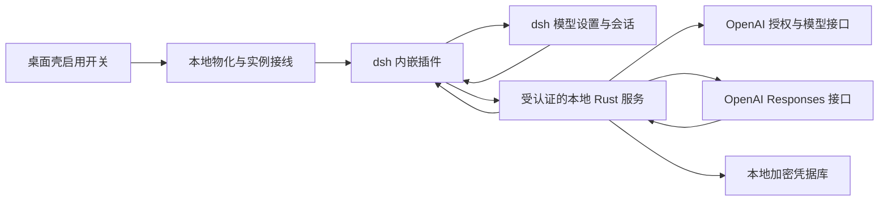

# 内嵌 OpenAI OAuth 插件设计

日期：2026-10-08。状态：设计稿，尚未实现。配套文档：[开发计划与验收](openai-oauth-development-plan.md)。

## 1. 产品目标

dsh-xlink 随安装包交付一个 dsh 专属的 OpenAI OAuth（开放授权）插件。用户自行决定是否启用，无需搜索插件、下载安装包或运行安装命令。启用后，在 dsh 工作台的模型设置中登录 ChatGPT，在会话中选择账号可用的 OpenAI 模型，并按该模型支持的范围设置思考强度。

本设计的“OpenAI OAuth”指 OpenAI 官方 Sign in with ChatGPT 的套餐授权路线。普通 OpenAI API（应用程序接口）密钥仍由现有模型提供方管理。两种路线使用不同的提供方标识和计费说明，不自动互相回退。

“无缝体验”的验收范围是模型选择、思考强度、流式回答、多轮上下文、dsh 工具调用、取消和会话恢复。ChatGPT 网站的历史、记忆、托管工具及全部产品功能不在这条模型接入路线的承诺内。OpenAI 明确说明套餐授权不开放 ChatGPT 历史对话。[官方授权范围](https://developers.openai.com/siwc/token-sharing-open-source)

## 2. 已确定的交付边界

| 项目 | 约定 |
| --- | --- |
| 内核范围 | 仅 `dsh` 族；其他内核族不展示启用入口、不接线 |
| 兼容承诺 | 最近 3 个官方发布的 dsh 内核版本，逐版本验收 |
| 默认状态 | 关闭；升级应用也不替用户开启 |
| 分发 | 插件代码与运行时依赖随应用交付，启用过程不访问 npm 或 GitHub |
| 开关范围 | 当前壳模式、当前 dsh 实例及 profile（运行配置）的组合 |
| 更新 | 随 dsh-xlink 更新；社区插件更新不管理此插件 |
| 网络 | 用户自行解决 OpenAI 的访问；应用提供可定位的连接错误 |
| 平台 | Intel macOS 与 Windows，与应用现有发布范围一致 |

内核安装树保持只读。插件资源、本地物化目录及实例配置分别维护，不把代码复制进已安装内核的 `node_modules`。这遵守根 [AGENTS.md](../../../AGENTS.md) 的内核边界。

### 最近 3 个版本的计算

以官方 npm registry 的 `@deepseek-ai/dsh` 发布记录为准：按发布时间倒序取最近 3 个已发布且未标记废弃的版本；包含正式版和预发布版，不用 `latest` 标签代替发布时间。应用仍按现有渠道设置决定是否展示预发布版。

当前窗口的版本快照与逐版本验证状态是活数据，记录在[开发计划 §1.1](openai-oauth-development-plan.md)，随 P0 调查与每次发布验收回写；本文只保留计算规则，不在正文维护版本清单。[官方版本记录](https://registry.npmjs.org/@deepseek-ai%2Fdsh)

发布应用前重新计算窗口。窗口内任一版本未通过完整验收，都不能发布“最近 3 个版本兼容”的声明。新内核发布后进入待验证状态；现有应用不会立即获得对未来版本的兼容保证。窗口之外只保留已有验证记录，不承诺继续修复。

## 3. 用户流程

### 3.1 启用入口

在桌面壳的“插件 → 当前内核”增加独立的“内嵌插件”区域，显示“OpenAI 对话”与启用开关。它不进入社区插件中央库，不显示安装、卸载、来源切换或单独更新按钮。

开关修改要求目标实例的内核已停止，复用实例级运行判据；不能只检查当前壳是否打开工作台。运行时显示“停止工作台后可修改”。首版通过下次启动加载或移除接线，避免新增未经验证的热加载行为。

启用时先验证内核兼容能力，再准备本地资源和接线。失败后开关保持关闭，说明失败原因。界面上的“已启用”必须对应已提交的接线状态；“已连接”还要求工作台已启动并完成模型目录读取，两者不能混用。

### 3.2 登录与模型设置

工作台“设置 → 模型”展示“OpenAI · ChatGPT 套餐”账户卡片：登录按钮、当前账户与工作区标签、授权状态、刷新模型列表、切换账户、退出登录和管理用量。

点击“使用 ChatGPT 继续”后打开系统浏览器。账号密码只由 OpenAI 页面接收。首次成功授权显示一次套餐使用说明，不自动发送收费探测消息；提供显式“测试连接”动作，执行一条短文本请求并说明会使用套餐额度。用量入口打开 OpenAI 的使用设置。[官方界面要求](https://developers.openai.com/siwc/ui-ux-guidelines)

优先使用 dsh 的模型设置扩展插槽。某个兼容版本没有卡片插槽时，使用该版本已验证的设置扩展入口；桌面壳账户页可用于诊断，但不能替代“工作台内可配置”这一验收要求。模型提供方与思考强度始终进入 dsh 的正式会话控件，不通过修改页面 DOM（文档对象模型）模拟。

OpenAI 与 ChatGPT 标志（如使用）一律为随应用交付的本地矢量并附来源与许可声明，不引用远端 URL；桌面壳侧遵守 `ui/public/` 的第三方标志规则（`check:invariants` 第 15 项）。

### 3.3 会话选择

提供方固定为 `xlink-openai-chatgpt`，显示名称为“OpenAI · ChatGPT 套餐”。模型行显示官方名称，必要时附精确模型标识。选择器附近显示“使用 ChatGPT 套餐”，避免与 API 密钥路线混淆。

模型与思考强度在发送时形成不可变快照。切换只影响下一次请求，不改已经运行的请求。标题生成和历史压缩也通过同一模型服务，不另建隐藏调用路径。

## 4. 总体架构

采用“内嵌 dsh 适配插件 + Rust OpenAI 服务”的组合。Rust 持有账号授权并承担 OpenAI 网络访问；插件把 dsh 的消息、模型能力和流式事件转换到应用自有的稳定协议。不同内核的兼容差异集中在薄适配层。

| 层 | 职责 |
| --- | --- |
| Rust 交付层 | 资源校验、兼容判定、实例接线、启用状态、诊断集成 |
| Rust OpenAI 服务 | 登录、身份校验、刷新、吊销、模型目录、请求校验、网络与流转发 |
| dsh Host 插件 | 注册模型适配器、投影模型能力、消息和工具转换、持久回放元数据 |
| dsh Client 插件 | 模型设置账户卡片、登录交互、套餐提示；继承内核主题 |
| 桌面壳 Vue 界面 | 内嵌插件开关、兼容状态及故障入口；沿用 Element Plus 与 `html.dark` |

这一拆分让旧内核不必具备新版凭据记录服务，所有兼容层也不用分别实现令牌刷新。dsh 继续拥有智能体循环、工具执行、审批、会话和附件；不启动第二套 Codex 智能体。

Rust 本地服务仅面向本次 dsh 子进程，以随机访问令牌绑定实例、profile、壳模式和启动代次。浏览器客户端经 dsh 的受权限控制远程接口读取脱敏状态，不能直接访问本地服务或取得连接令牌。它不是可配置上游的公共中转服务器。

## 5. 免安装与兼容机制

### 5.1 本地资源

应用构建时预编译 Host 与 Client 插件，生成包含文件摘要、插件版本、桥接协议版本及兼容描述的资源清单。启用时校验资源并物化到实例的专用内嵌插件目录。

物化目录按“插件版本 + 内核依赖指纹 + 兼容层”区分。运行中的目录不覆盖，不复用会被另一个实例改写的 peer（宿主依赖）链接。Cordis、dsh 服务与 React 必须来自目标内核；仅插件自己的普通依赖随包交付。

已有社区接线链包含 pnpm 安装与孤儿目录清理（实现细节见 [plugin-internals.md](plugin-internals.md)，用户可见设计见 [plugin-management.md](plugin-management.md)），不能原样用来满足免安装要求。内嵌目录应独立于社区插件目录，并与清理、隔离及安全模式登记清晰的所有权边界。

### 5.2 兼容判定

先只读检查目标内核的包版本、导出和依赖指纹，再在临时隔离实例验证加载、目录与会话接口。候选兼容层必须满足全部必要能力：模型路由、正式模型选择器、按模型的思考强度、流式终止、工具关联和回放持久化。

客户端账户卡片可以按版本使用不同公开扩展入口，必要能力不能降级为“模型能显示就算支持”。窗口内缺能力的版本是发布阻塞项，需要完成兼容实现；不能用隐藏按钮、忽略参数或假绿状态绕过。

当前主分支有模型设置插槽和按模型的思考强度类型，但不能据此认定 3 个 npm 发布包都具备相同接口。[dsh 插槽契约](https://github.com/deepseek-ai/deepseek-harness/blob/5badb15009ae1756c3afe0ae0cef1faafc290ccc/packages/client/ui-settings-models/src/client/slot-contract.ts)、[模型与强度类型](https://github.com/deepseek-ai/deepseek-harness/blob/5badb15009ae1756c3afe0ae0cef1faafc290ccc/packages/llm/llm/src/types.ts)

## 6. 模型目录与思考强度

### 6.1 模型目录

可选择目录来自当前账户授权下的官方模型列表。保留服务端 `slug`、显示名称与排序；不要把普通 API 目录或某个 SDK（软件开发工具包）的静态目录当作账户权限证明。[官方模型发现](https://developers.openai.com/siwc/token-sharing-open-source/models-and-inference)

最终可用集合是“账号公开目录 ∩ 当前授权路线支持 ∩ 已验证的模型能力”。设置页可显示暂不支持的条目及原因；会话选择器只提供可正确请求的条目。目录出现不保证当次请求成功，额度和工作区策略仍可能拒绝。

不能按名称前缀把“GPT”“Codex”或某代模型整体排除。逐模型判定是否可用于当前会话：不支持工具的对话模型只能用于经过验证的无工具配置，不能静默删除 dsh 已声明的工具。授权目录没有的模型不凭手工输入冒充可用。

模型列表没有完整能力元数据时，用随应用交付、带来源与验证记录的精确模型能力表补齐上下文容量、输入模态、工具与强度。未知模型保留为“能力待验证”，不猜测容量或强度，也不自动发请求逐档试探。能力更新随应用发布。

账号切换立即使旧目录失效。离线缓存按账号注册、路线和能力表版本隔离；只有未过期且身份匹配的缓存才能继续提供选择。目录失败不返回空列表冒充成功，保留最后一次成功记录并标记时间与状态。

### 6.2 思考强度

| 场景 | 行为 |
| --- | --- |
| 模型支持可选强度 | 仅展示该模型支持的值与“模型默认” |
| 模型不支持强度参数 | 隐藏强度控件，请求不发送 `reasoning.effort` |
| 用户选择“模型默认” | 请求省略强度字段，不统一改成 `medium` |
| 切到另一模型，旧值仍有效 | 沿用该值，并在发送前再次校验 |
| 切到另一模型，旧值无效 | 阻止发送并提示重新选择，不能静默改成较低强度 |
| 能力未知 | 不显示未经验证的强度选项 |

强度 ID（标识符）与 OpenAI 接收的字符串精确对应。`none`、`minimal`、`low`、`medium`、`high` 等并不是全模型通用枚举；也不能把“关闭”一律映射为 `none`。dsh 的控件、会话存储、插件适配器和 Rust 请求校验必须使用同一能力快照。[OpenAI 思考强度说明](https://developers.openai.com/api/docs/guides/reasoning)

偏好按实例、profile、提供方和模型保存；每个请求记录最终模型与强度。模型目录变更后重新校验。已明确选择的值若被服务端拒绝，呈现错误并更新诊断，不能偷偷删掉参数重试。

## 7. 对话、工具与历史

使用官方公开 Responses 接口，令牌只由 Rust 加入请求。套餐路线固定 `store: false`、`stream: true`，每次发送由 dsh 历史重建的必要上下文。[调用要求](https://developers.openai.com/siwc/token-sharing-open-source/models-and-inference)

系统指令转换为该路线接受的指令或 developer 消息。工具定义按官方支持格式组织，名称转换可逆，工具调用标识与结果严格配对；执行和审批继续走 dsh。不向套餐路线发送不支持的托管工具或 `tool_search`，也不能把工具结果拼成普通用户文本蒙混通过。

公开的思考摘要可进入 dsh 思考块；未返回摘要时只显示等待状态，不能把加密思考内容展示或解密。`encrypted_content` 等提供方回放材料通过 dsh 的适配器私有元数据持久化，保证工具往返、重启及长会话不会只剩可见文字。跨账户、路线或不兼容模型时不复用这些材料。[无服务端存储的思考回放](https://developers.openai.com/api/docs/guides/reasoning)

图片能力需同时通过模型与内核验证。文件附件遵循 dsh 既有文件句柄和工具读取约定，不自行上传到 Files API。音视频、图像生成及 OpenAI 托管工具不在本路线的首版范围内。[套餐路线限制](https://developers.openai.com/siwc/token-sharing-open-source/preview-limitations)

流读到成功终止事件才结算成功。中断、失败、未完成必须分别保留；已经输出的文本不丢失，错误也不能被 EOF（流结束）改写为成功。用量采用服务端返回值，不推算套餐余额或伪造 API 美元费用。

## 8. OAuth 与本地安全

首次动态注册使用官方规定的入口，保存返回的客户端注册标识；再次登录复用对应注册。宿主标识生成后持久保存，不能因每次启动或登录而变化。每次登录准备独立的 `state`、OIDC（开放身份连接）`nonce` 与 PKCE（授权码交换证明密钥）。本地回调严格绑定 `127.0.0.1`、路径和本次端口。[官方登录流程](https://developers.openai.com/siwc/token-sharing-open-source/sign-in)

验证身份令牌签名、签发方、受众、有效期、nonce 与套餐授权范围后才激活账户。相同邮箱的不同注册或工作区分别保存，不能混用客户端标识与令牌。浏览器取消不覆盖现有账户。

凭据采用本地加密文件，文件密钥存于 macOS Keychain 或 Windows Credential Manager（凭据管理器）。令牌、身份令牌及刷新令牌原子替换；macOS 使用仅属主权限，Windows 校验用户 ACL（访问控制列表），不能以 Unix 权限位代替 Windows 权限验证。系统凭据库不可用时暂停登录，不退回明文保存。

刷新按账户注册串行，写入失败不报告更新成功。退出账户先停止新请求并取消该账户在途请求，再尝试吊销与清除令牌；网络失败时明确说明远端吊销未确认。关闭插件保留授权以便再次启用，但插件关闭期间不刷新令牌、不访问 OpenAI。再次启用后按实际过期状态刷新或重新登录。[账户与令牌规范](https://developers.openai.com/siwc/token-sharing-open-source/profiles-and-sessions)

账户数据的删除边界：退出登录清除该账户令牌；另提供“删除本地数据”动作，一并清除加密凭据文件、脱敏账户索引、目录缓存与系统凭据库中对应条目。应用卸载不清理系统凭据库条目，卸载后残留的只有加密文件密钥、不含令牌本体；该限制写入排障文档。

## 9. 网络、故障与资源生命周期

浏览器登录、模型目录与推理请求使用的网络路径可能不同。Rust 出网复用仓库的 `net_proxy::routes()` 与传输错误分类，允许用户现有系统代理配置生效。只在传输失败且请求可安全重发时尝试下一路由；不能把额度、鉴权和请求格式错误当作网络错误。

本设计不增加代理提供商、自动隧道或账户共享。保留 TLS（传输层安全协议）校验，不允许把 OAuth 令牌发送给用户填写的任意端点。连接失败提供阶段、可安全显示的原因、日志位置和重试入口，不把网络故障归因为插件坏了。

工作台停止后撤销本次桥接令牌、关闭监听和连接。应用升级只准备新的资源目录，下次停机启动时切换；失败恢复上一份已验证接线。恢复出的旧版本接线与本代次服务握手不匹配时，按启动验证失败进入隔离，不跨协议降级（处置见[开发计划 §5](openai-oauth-development-plan.md)）。安全模式与诊断隔离可以跳过内嵌插件，且不清除账号或把用户选择重置为关闭。日志记录版本、兼容层、模型、最终强度、请求关联与终止状态，令牌、授权回调参数和对话正文默认不记录。

## 10. 实现前必须验证的事项

| 验证项 | 当前状态 | 影响 |
| --- | --- | --- |
| 3 个发布包的 Host、Client、选择器与强度接口 | 未验证 | 决定兼容层数量与接线方式 |
| 免 pnpm 接线、宿主依赖同一实例、离线首启 | 未验证 | 决定能否兑现免安装 |
| 官方动态注册到真实套餐推理 | 未验证 | 决定账号接入是否可用 |
| 模型目录与精确强度能力来源 | 文档已确认规则，真实账号未验证 | 决定可公布的模型集合 |
| 工具往返及私有回放元数据在重启后保留 | 未验证 | 决定多轮会话正确性 |
| macOS / Windows 加密凭据和网络路由 | 未验证 | 决定两平台交付是否完整 |

这些事项按[开发计划](openai-oauth-development-plan.md)逐项验收。本文确立产品与工程约束，不表示插件已可运行。
