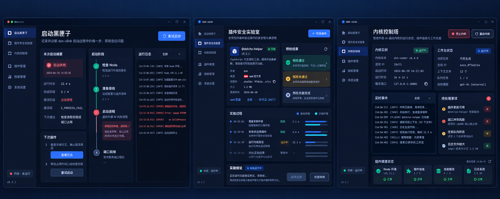
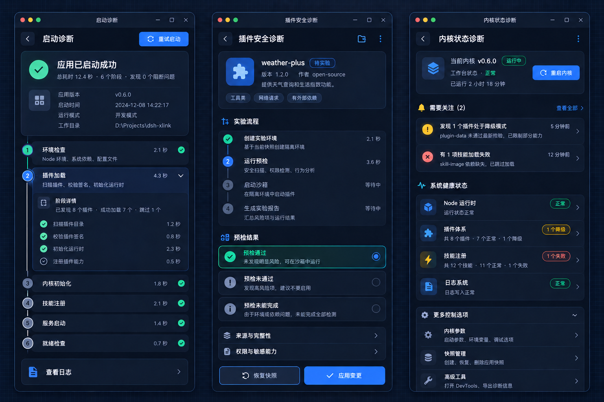

# 运行诊断功能开发设计

> 状态：设计稿
>
> 日期：2026-10-06
>
> 适用范围：启动诊断、插件安全诊断、内核状态诊断
>
> 读者：前端、Rust 后端、测试和后续维护 dsh-xlink 的 agent

本文以当前 dsh-xlink 的真实界面截图为基线，规定三项诊断功能的产品边界、页面结构、前后端契约、实现顺序和验证要求。实现时应先读本文，再读根目录 AGENTS.md、ui/AGENTS.md 和 src-tauri/AGENTS.md。

本设计不改变内核本身，也不允许把诊断逻辑写入已经安装的内核目录。诊断只观察 Shell、实例、插件、技能、进程和日志，并通过现有的沙盒、快照、恢复与进度机制执行可控操作。

## 1. 结论

三项功能使用统一的“运行记录”模型：

    启动内核 / 预检插件 / 恢复快照 / 二分排查
                      ↓
               一次可追溯的运行记录
                ↙          ↓          ↘
            启动诊断   插件安全诊断   内核状态诊断

实现顺序固定为：

1. 先建立运行记录和结构化事件。
2. 再交付启动诊断，验证事件链和错误归因。
3. 再把同一套时间线用于插件安全诊断。
4. 最后把运行记录、状态快照和待处理事项汇总到内核状态诊断。

三项功能首期不新增三个一级侧栏菜单：

- 启动诊断从概览页的“工作台”动作、启动失败横幅和事故面板进入。
- 插件安全诊断从插件安装、更新和“预检”动作进入。
- 内核状态诊断作为概览页的诊断视图和状态卡，不独立占用一个导航位置。

这样可以保留当前 480×800 窄窗口中的导航密度，也避免用户在“概览、启动诊断、内核状态诊断”之间看到重复信息。

## 2. 真实 UI 基线

### 2.1 截图资料

截图已经复制到仓库，后续 agent 可以直接查看：

| 界面 | 参考图 |
| --- | --- |
| 概览 | [overview.png](images/ui-baseline/overview.png) |
| 内核版本 | [versions.png](images/ui-baseline/versions.png) |
| 插件 | [plugins.png](images/ui-baseline/plugins.png) |
| 技能 | [skills.png](images/ui-baseline/skills.png) |
| 设置 | [settings.png](images/ui-baseline/settings.png) |

截图不是待复制的静态稿，而是现有产品的视觉和交互约束。新增页面应继续使用它的标题栏、品牌区、导航、卡片和状态语义。

### 2.2 UI 设计参考图

本节图片是诊断功能的方案参考，不是当前版本的运行截图。图中的版本号、路径、耗时、插件名和日志文案都是示意值，不能直接写入接口、测试断言或生产数据。

宽图用于理解三个诊断页面之间的信息层级和组件复用关系，不代表 dsh-xlink 要改成宽屏三栏窗口：

窄图是实现时的主要参考。它按当前 480×800 窗口的比例绘制，标题已经统一为“启动诊断”“插件安全诊断”和“内核状态诊断”：

读图时重点看四件事：

1. 页面标题使用用户能直接理解的功能名，不使用内部模块名。
2. 返回按钮位于页面头部左侧，返回上一个面板，不改变内核状态。
3. 页面右侧的主操作和更多菜单按页面语境出现，不把所有动作堆到全局导航。
4. 时间线、状态卡和证据入口使用现有卡片语言，颜色只表示真实状态。

### 2.3 已确认的窗口约束

- 主窗口尺寸为 480×800 CSS 像素。
- 主窗口不可缩放，tauri.conf.json 中 resizable 为 false。
- 480 像素下 theme.css 的窄布局是常态，不是备用响应式布局。
- 品牌区在上方，菜单在品牌区下方横向排列，面板内容从菜单下方开始。
- 诊断页面必须支持纵向滚动，不能依赖横向三栏布局。
- 长日志继续交给现有日志弹层或独立日志窗口，不在 480 像素内硬塞完整日志。
- 关闭主窗口仍然只是收进后台，不得因为打开诊断视图改变常驻行为。

### 2.4 视觉令牌

当前主题的关键令牌来自 ui/src/theme.css：

| 用途 | 当前值 |
| --- | --- |
| 页面底色 | #0b1020 |
| 卡片底色 | rgba(255, 255, 255, 0.05) |
| 普通边框 | rgba(255, 255, 255, 0.1) |
| 正文 | #e8ecf7 |
| 次要文字 | #9aa4bf |
| 主强调色 | #4f8cff |
| 辅助强调色 | #22d3ee |
| 成功 | #34d399 |
| 警告 | #fbbf24 |
| 失败 | #f87171 |
| 圆角 | 14px |

诊断界面不新增一套颜色。颜色只能表达真实状态，不能用装饰色制造“看起来很忙”的效果。数字和日志可以使用等宽字体，普通中文仍使用现有系统字体栈。

### 2.5 菜单和按钮设计

#### 2.5.1 菜单层级

当前顶部菜单继续由 SideBar.vue 管理，固定项仍是：

    概览    内核版本    插件    技能    设置

数据迁移是已有的条件菜单项，只在检测到可迁移遗留数据且没有迁移历史时出现。它不能被诊断功能复用，也不能为了放置诊断入口而改成常驻项。

三项诊断功能不加入顶部菜单。入口按用户正在处理的对象分配：

| 入口位置 | 打开的诊断页面 | 入口按钮文案 | 说明 |
| --- | --- | --- | --- |
| 概览页工作台动作、启动失败横幅、事故面板 | 启动诊断 | 启动诊断 / 查看启动诊断 | 关注一次启动过程和失败归因 |
| 插件安装、更新、预检结果 | 插件安全诊断 | 查看安全诊断 / 查看预检详情 | 关注某次插件变更 |
| 概览页当前内核卡、关注项和健康状态 | 内核状态诊断 | 查看状态 / 查看全部关注项 | 关注当前实例的运行快照 |

顶部菜单只负责切换面板。点击菜单不能隐式启动、停止、安装、恢复或刷新内核。需要执行 IO（输入输出）或改变状态的行为必须使用页面内的动作按钮，并接入现有 loading（加载态）和进度机制。

#### 2.5.2 顶部菜单按钮

顶部菜单沿用 SideBar.vue 的现有实现和窄窗口样式：

- 正常态使用次要文字色、透明背景、现有图标和短标签。
- 悬停态只提高文字对比度并显示浅色背景，不改变布局宽度。
- 激活态只保留一个。窄窗口使用主强调色和字重变化，宽布局继续使用左侧指示条和浅色背景。
- 按钮使用 button 元素，必须保留键盘焦点。focus-visible（键盘可见焦点）时显示清晰的焦点环，不能用 outline: none 直接消除。
- 按下时沿用当前轻微缩放反馈，过渡时间保持在 120ms 左右。用户设置 prefers-reduced-motion（减少动态效果）时，关闭缩放和滑动动画。
- 更新数量角标只表示确实存在的可更新项。没有数量时不显示空角标，数量超过 99 显示 99+，具体含义放在 title 或无障碍标签中。
- 菜单切换本身不显示旋转图标。刷新、检查更新、安装和恢复等异步动作的 loading 只放在触发该动作的按钮上。

窄窗口的五个固定项必须保持一行可读。通过缩小图标与文字之间的空隙、保留现有 6px 上下内边距来控制密度，不再增加新的一级项。条件显示的数据迁移项继续遵守当前换行规则。

#### 2.5.3 页面头部按钮

诊断页面不使用新的全局导航。进入诊断后，在内容区显示页面头部，结构与窄图一致：

    [返回]  页面标题                         [主操作] [更多]

页面头部的按钮分成四类：

| 按钮 | 视觉形式 | 行为约束 |
| --- | --- | --- |
| 返回 | 32×32 左箭头图标按钮 | 只关闭诊断层，恢复进入前的面板和滚动位置，不触发内核动作 |
| 主操作 | 蓝色实心按钮，带图标和文字 | 每个页面最多一个，文案使用动词，例如重试启动、应用变更、重启内核 |
| 次要操作 | 文字按钮或描边按钮 | 用于查看日志、导出摘要、恢复快照等低频动作 |
| 更多 | 32×32 图标按钮，使用 MoreFilled | 打开当前页面的上下文菜单，不放全局设置和跨页面导航 |

返回按钮必须有 aria-label（无障碍名称）和可见的悬停提示。图标按钮不能只依赖图形猜含义。主操作即使在卡片底部再次出现，也要复用同一个动作函数和 loading key（加载键），不能产生两个互不相干的实现。

诊断层覆盖标题栏下方的 KernelTabs、品牌、菜单和面板内容，保留 Tauri 自绘标题栏。诊断层打开时不切换 store.activePanel，也不响应顶部菜单点击。这样用户不会在执行一次排查的中途误切到另一个面板。返回后恢复进入前的 activePanel 和可恢复的滚动位置。

#### 2.5.4 操作按钮的状态

所有会触发 Rust 命令、文件读写、进程启动、网络请求或长任务的按钮都按下表实现：

| 状态 | 视觉 | 行为 |
| --- | --- | --- |
| normal | 当前主题的默认按钮样式 | 可以点击 |
| hover | 提高背景和边框对比度 | 不改变文案、不移动相邻元素 |
| focus-visible | 显示焦点环 | 键盘可以进入和触发 |
| pressed | 轻微缩放或降低不透明度 | 只提供即时反馈，不代表任务已成功 |
| loading | 保留原文案，显示旋转图标 | 禁止重复点击，使用 withLoading 管理 |
| disabled | 降低对比度并保留原因提示 | 不能用隐藏按钮代替禁用；需要告诉用户是内核运行、没有快照还是缺少权限 |
| success | 使用成功色状态标签或结果卡 | 只在命令确认成功后显示 |
| warning / failure | 使用警告或失败色状态标签 | 同时给出下一步动作和日志入口 |

按钮文案在 loading 期间不改成“处理中”这类泛化文字，避免窄窗口宽度跳动。可以在按钮外的状态区域显示“正在检查环境”或“正在启动内核”等阶段文案。

互斥动作使用现有 globalBusy（全局忙碌）策略。例如启动、停止、安装、恢复期间，不能让用户同时点击会改变同一实例的版本切换、插件删除或内核重启。只读的查看日志和展开证据可以继续使用。

#### 2.5.5 诊断页面的更多菜单

更多菜单只收纳当前页面的低频动作，使用 Element Plus 下拉菜单和现有图标，不引入新的菜单组件。推荐菜单内容如下：

启动诊断：

    查看完整日志
    导出本次诊断摘要
    复制运行记录编号

插件安全诊断：

    查看插件来源
    查看权限与敏感能力
    打开完整日志

内核状态诊断：

    刷新状态
    查看完整日志
    打开高级工具

恢复、删除插件、切换版本、重启内核等可能改变状态的操作不能只藏在“更多”里。它们应在当前状态允许时以明确的主操作或次要操作呈现；涉及删除或覆盖的动作必须单独确认，并显示影响范围。

菜单项触发异步动作时，菜单可以先关闭，原按钮进入 loading。命令失败后不要只在菜单项上显示红色，页面应保留失败结果、日志路径和可重试动作。

#### 2.5.6 卡片行和状态入口

带右箭头的状态行表示可以进入详情，整行可点击，右侧箭头只是提示，不再额外做一个重复按钮。行内已有开关、删除、安装或更多按钮时，点击这些控件必须阻止冒泡，避免同时打开详情。

状态卡的颜色和按钮动作要保持一致：

- 绿色状态只代表已确认正常，不代表“最近一次检查没有报错”。
- 黄色状态进入关注项或预检详情，不直接执行修复。
- 红色状态进入失败证据和恢复动作，主按钮文案必须说明要做什么。
- 灰色状态代表尚未检查、没有数据或无法判断，不得写成成功。

#### 2.5.7 菜单设计验收

- 480×800 下固定五项菜单不换行，诊断入口不挤占顶部菜单。
- 鼠标、键盘和辅助技术都能识别当前菜单项和页面头部按钮。
- 菜单切换不会启动或停止内核，也不会隐式修改插件、技能和版本。
- 所有异步按钮都有独立 loading key，重复点击不会产生第二个任务。
- 打开诊断层后，返回按钮能恢复原面板；刷新、重启、恢复等动作不会误用返回逻辑。
- 失败按钮能看到原因、日志入口和下一步动作；长任务失败后进度面板仍保持开放。
- 动作状态与 cause、status 的运行记录一致，不能只依靠按钮颜色判断结果。

## 3. 现有能力与接入点

### 3.1 前端现有组件

| 现有文件 | 可复用能力 | 本设计中的用途 |
| --- | --- | --- |
| ui/src/shell/OverviewPanel.vue | 当前内核、工作台、日志和用量入口 | 启动诊断和内核状态诊断入口 |
| ui/src/plugins/PluginsPanel.vue | 插件安装、更新、预检开关和插件中心 | 插件安全诊断入口 |
| ui/src/plugins/PrecheckDialog.vue | 预检三态展示和证据展开 | 演进为插件安全诊断结果视图 |
| ui/src/incidents/IncidentModal.vue | 启动事故、嫌疑插件、日志和处置动作 | 启动诊断失败态和恢复入口 |
| ui/src/diagnostics/SnapshotRestoreDialog.vue | 恢复差异、恢复结果和三态验证 | 插件变更前后回退与恢复结果 |
| ui/src/logs/LogModal.vue | 日志文件列表、正文、刷新和独立窗口 | 诊断证据查看 |
| ui/src/shell/ProgressOverlay.vue | 长任务进度、实时输出和失败后保持开放 | 预检、恢复、二分和启动过程 |
| ui/src/shell/bridge.js | Tauri invoke 和 Channel 唯一入口 | 所有诊断命令通信 |
| ui/src/shell/loading.js | 按动作粒度的 loading（加载态） | 按钮防重复提交 |
| ui/src/shell/progress.js | 长任务进度编排 | 事件流和日志流消费 |

组件只读状态、调动作。不要在新组件里直接访问 window.__TAURI__，也不要在组件内重复实现请求去重、错误提示或进度消费。

### 3.2 后端现有能力

| 现有模块或命令 | 当前能力 | 本设计中的用途 |
| --- | --- | --- |
| diagnostics::guard / start_kernel | 看护式启动、环境失败识别、插件归因和事故报告 | 发出启动诊断事件 |
| diagnostics::perf::collect_status / get_status | 内核、Node、端口和运行态快照 | 内核状态诊断的基础快照 |
| plugins::precheck / plugin_precheck_install | 基线、沙盒安装、探测、回滚和三态结果 | 插件安全诊断的执行主体 |
| plugins::sandbox | 临时实例、临时端口、子进程回收和探测 | 预检和恢复后的验证 |
| diagnostics::snapshot | startup-ok、pre-change、manual 快照 | 诊断记录和回退依据 |
| diagnostics::restore | 差异预览、恢复、跳过项和恢复后验证 | 插件变更后的回退 |
| diagnostics::bisect | 候选集、试探、三态探测和中止 | 后续接入启动诊断的排查入口 |
| notify | 内核任务事件流、未读数和状态广播 | 控制塔实时关注项 |

命令层 src-tauri/src/commands.rs 只做参数解析、锁和 spawn_blocking（阻塞任务移交）。新的运行记录主体放进 src-tauri/src/diagnostics/，避免继续膨胀 commands.rs。

## 4. 统一运行记录

### 4.1 数据对象

建议新增 src-tauri/src/diagnostics/run.rs，负责运行记录模型、事件记录、裁剪和脱敏。这里的 run 指一次可追踪操作，不等同于内核进程。

首期数据结构如下：

    {
      "schema": 1,
      "id": "run-20261006-143201-a1b2",
      "kind": "startup",
      "family": "dsh",
      "instanceId": "default",
      "kernelVersion": "0.2.1-alpha.1",
      "profile": "web",
      "startedAtMs": 1791268321000,
      "finishedAtMs": 1791268333400,
      "status": "failure",
      "cause": "environment",
      "summary": "启动失败，未进入端口就绪阶段",
      "evidence": {
        "logPath": ".../logs/kernel.log",
        "incidentId": "..."
      },
      "events": [
        {
          "seq": 1,
          "stage": "detect-node",
          "status": "success",
          "atMs": 1791268321100,
          "durationMs": 1200,
          "message": "检测到满足要求的 Node.js"
        }
      ]
    }

字段规则：

- kind 首期支持 startup、plugin-precheck、restore、bisect。
- status 是运行记录状态，取值为 running、success、warning、failure、inconclusive、canceled。
- cause 沿用现有事故归因语义，至少支持 environment、kernel、plugin、skill、frontend 和 unknown。
- stage 使用稳定英文标识，中文显示名集中放在前端 labels.js 或诊断模块的展示函数中。
- seq 用于在同一毫秒内保持顺序，不能只依赖时间戳排序。
- 未知的 stage、status 和 cause 必须原样保留，并在 UI（用户界面）中显示为“未知阶段”或“未知原因”，不能静默丢弃。
- 记录不包含会话正文、附件内容、凭据、令牌或完整环境变量。
- 原始日志继续写入现有日志目录。运行记录只保存摘要、路径和少量证据尾部。

### 4.2 建议的存储位置

按实例保存，避免两个实例共享“上一次良好状态”：

    <instance_dir>/diagnostics/runs/index.json
    <instance_dir>/diagnostics/runs/<run_id>.json

建议只保留最近 20 条运行摘要，单条运行详情随摘要一起保留。超过数量后删除最旧的普通记录，但不能删除仍被事故、快照或未读通知引用的记录。原始日志的清理继续使用现有日志清理策略。

写入规则：

1. 使用 state.rs 的容错读和校验写能力，不在多个模块各自读写 JSON。
2. 使用临时文件、同步和原子替换。
3. 写入失败只记录 Shell 事件，不阻断启动、预检或恢复主流程。
4. 测试必须持有 scoped_xlink_home、TestHome 或 TempXlink，不能触碰用户真实数据目录。

### 4.3 事件传输

当前启动和预检命令使用 Channel<String>。首期保持命令签名稳定，通道消息升级为 JSON 字符串，前端统一解析：

    {
      "type": "diagnostic-event",
      "runId": "run-...",
      "event": {
        "seq": 2,
        "stage": "spawn-kernel",
        "status": "running",
        "message": "正在启动内核"
      }
    }

兼容规则：

- 解析失败的消息仍作为普通进度文本显示，不能让进度面板整体失效。
- ProgressOverlay 继续显示人话进度。
- 结构化事件交给诊断时间线。
- 登录自启没有前端 Channel，仍然创建运行记录并把进度写入 Shell 日志。
- 运行记录落盘完成后，命令返回值中的 runId 与事件中的 runId 必须一致。

## 5. 启动诊断

### 5.1 产品定位

启动诊断回答一个问题：这次启动停在哪一步，用户接下来能做什么。

它不是第二个日志查看器，也不替代 IncidentModal 的插件处置动作。启动诊断负责时间线和证据索引，事故面板负责处置嫌疑插件、打开日志和恢复操作。

### 5.2 入口

- 概览页“工作台”按钮启动后，用户可以打开“查看启动过程”。
- StartReport 有事故或告警时，横幅提供“查看启动诊断”。
- IncidentModal 顶部显示本次运行摘要，并提供“查看完整诊断”。
- 登录自启产生的最近一次记录，在概览页显示为“后台启动记录”。

### 5.3 页面结构

    ┌──────────────────────────────────────┐
    │ ‹  启动诊断                    重试启动 │
    ├──────────────────────────────────────┤
    │ [状态摘要]                             │
    │ 启动失败                               │
    │ 耗时 12.4 秒 · 完成 3 / 6 个阶段       │
    │ 失败阶段：启动内核                      │
    ├──────────────────────────────────────┤
    │ 启动阶段                               │
    │ ① 检查 Node.js                    ✓   │
    │ ② 准备插件接线                    ✓   │
    │ ③ 启动内核                        ×   │
    │    端口未开始监听                       │
    │    查看证据                         >   │
    │ ④ 端口就绪                        ○   │
    ├──────────────────────────────────────┤
    │ 下一步                                 │
    │ 端口可能被占用，或内核进程未能派生。     │
    │ [查看日志]                             │
    └──────────────────────────────────────┘

布局规则：

- 顶部只保留返回和一个主要动作。主要动作根据状态显示“重试启动”或“打开工作台”。
- 摘要卡只回答状态、耗时、完成阶段和失败阶段，不放完整日志。
- 时间线按阶段显示，默认只展开第一个失败阶段。
- 证据区使用折叠行。日志正文由 LogModal 或独立日志窗口打开。
- 运行中时，当前阶段使用蓝色或青色强调，不能显示为成功。
- 失败时必须同时显示原因类别和下一步，不能只显示“启动失败”。
- 启动成功但带警告时，标题显示“已启动，有告警”，不能只显示“运行中”。

### 5.4 启动阶段建议

后端不必把每一行日志都变成事件，只记录用户能理解的阶段：

| 阶段标识 | 中文标题 | 主要来源 |
| --- | --- | --- |
| resolve-instance | 解析实例 | instance::resolve_default |
| detect-node | 检查 Node.js | Node 缓存与重新探测 |
| resolve-pnpm | 准备 pnpm | promise_pnpm |
| prepare-wiring | 准备插件接线 | 插件 profile 接线 |
| spawn-kernel | 启动内核 | 适配器派生进程 |
| wait-ready | 等待端口就绪 | guard::watch |
| health-check | 检查工作台状态 | 端口、进程和健康状态 |
| record-startup-ok | 保存成功快照 | snapshot::record |

guarded_start 的自动重试要在同一条时间线上标记“第 1 次尝试”“第 2 次尝试”，不能把多次尝试拼成一条看似连续且成功的流程。环境类失败要明确标记为环境问题，不能误归因到插件。

### 5.5 状态矩阵

| 状态 | 摘要文案 | 可用动作 |
| --- | --- | --- |
| 无记录 | 还没有启动诊断记录 | 启动工作台 |
| 运行中 | 正在启动工作台 | 查看当前阶段、收起窗口 |
| 成功 | 工作台已启动 | 打开工作台、查看过程 |
| 有告警 | 工作台已启动，但有告警 | 查看事故、查看日志 |
| 失败 | 工作台未能启动 | 重试启动、查看日志、打开事故 |
| 无法判断 | 证据不足，暂时无法判断失败原因 | 查看日志、重新启动 |
| 已取消 | 用户中止了本次诊断 | 重新启动 |

“无法判断”只在日志写入失败、进程状态无法确认或事件流中断时使用。它不等于失败。

## 6. 插件安全诊断

### 6.1 产品定位

插件安全诊断回答三个问题：候选插件是什么、预检做了什么、应用变更是否可回退。

它复用现有 plugin_precheck_install、plugins::sandbox、snapshot 和 restore 能力。预检仍然必须先跑基线，再安装候选插件，再启动沙盒并探测。基线失败时结果必须是 inconclusive，不能把候选插件判成坏包。

### 6.2 入口和操作边界

- 插件中心的安装按钮进入预检流程。
- 已安装插件的更新按钮进入同一流程。
- “预检”开关仍保留在插件面板，用于控制默认是否先预检。
- 用户主动关闭预检后，普通安装可以继续，但安装入口必须显示“未执行预检”的提示。
- 应用变更之前创建 pre-change 快照。
- 应用变更不自动修改已安装内核目录，不自动启动用户正在使用的内核。
- 工作台或目标实例运行时，应用变更按钮置灰，并显示可操作原因。

### 6.3 页面结构

    ┌──────────────────────────────────────┐
    │ ‹  插件安全诊断                关闭   │
    ├──────────────────────────────────────┤
    │ [候选插件]                             │
    │ plugin-name                           │
    │ 版本 1.2.0 · npm 来源 · 摘要已校验      │
    │ 来源与完整性                        >  │
    │ 权限与影响范围                      >  │
    ├──────────────────────────────────────┤
    │ 实验流程                               │
    │ ✓ 创建沙盒环境                         │
    │ ✓ 建立基线                             │
    │ ◉ 安装并验证候选插件                   │
    │ ○ 启动沙盒并探测                       │
    │ ○ 生成预检报告                         │
    ├──────────────────────────────────────┤
    │ 预检结果                               │
    │ [✓ 预检通过]                           │
    │ [! 预检未通过]                         │
    │ [i 预检未能完成]                       │
    ├──────────────────────────────────────┤
    │ [恢复快照]                  [应用变更] │
    └──────────────────────────────────────┘

### 6.4 预检结果表达

| 后端结果 | UI 标题 | 颜色 | 应用变更 |
| --- | --- | --- | --- |
| pass | 预检通过 | 成功绿 | 可用，若有告警必须同时显示告警 |
| fail | 预检未通过 | 失败红 | 禁用，先查看证据 |
| inconclusive | 预检未能完成 | 警告黄或信息灰 | 禁用，提示补充动作 |

“预检通过，但有告警”是 pass 的特殊展示，不得被压缩成普通“预检通过”。

### 6.5 证据和风险内容

候选插件卡片首屏只展示：

- 插件名称和版本。
- 来源类型和来源地址的短名称。
- sha512 或 sha256 完整性校验结果。
- 当前预检模式：链接或复制。
- 当前是否影响默认实例。

以下内容折叠展示：

- 依赖和外部依赖。
- 是否包含 prepare、构建或安装脚本。
- 沙盒日志路径。
- 候选插件物化前后的差异。
- 被跳过、无法恢复或无法验证的条目。

不得在首屏显示完整环境变量、凭据路径内容、会话正文或令牌。

### 6.6 变更提交流程

    选择候选版本
          ↓
    建立 pre-change 快照
          ↓
    沙盒预检
          ↓
    展示 pass / fail / inconclusive
          ↓
    用户确认应用
          ↓
    走现有插件变更路径
          ↓
    刷新插件状态和内核状态

应用变更失败时：

- 进度面板保持开放。
- 原始输出落盘并显示日志路径。
- 不自动删除中央库条目。
- 如果发生部分应用，逐条列出已应用和未完成项。
- 恢复操作必须先显示差异，再执行恢复。

## 7. 内核状态诊断

### 7.1 产品定位

内核状态诊断是概览页的“现在发生了什么”视图。它不重复展示所有历史事件，而是把当前内核、实例、插件、技能、Node、日志和待处理事故放在同一条可追踪路径上。

### 7.2 页面结构

    ┌──────────────────────────────────────┐
    │ 内核状态诊断                    更多 > │
    ├──────────────────────────────────────┤
    │ 当前内核                               │
    │ DSH · 0.2.1-alpha.1 · 已停止           │
    │ 实例 default · 端口 3090               │
    │ [工作台]                              │
    ├──────────────────────────────────────┤
    │ 需要关注                         2 项  │
    │ 插件预检未完成                    >   │
    │ 上次启动失败                      >   │
    ├──────────────────────────────────────┤
    │ 系统健康                               │
    │ Node.js             正常           >   │
    │ 插件接线             3 / 3          >   │
    │ 技能注册             正常           >   │
    │ 日志系统             正常           >   │
    ├──────────────────────────────────────┤
    │ 最近一次操作                           │
    │ 启动诊断 · 12 分钟前               >   │
    └──────────────────────────────────────┘

设计规则：

- “当前内核”卡保留现有概览页主按钮语义，仍然只有一个工作台启停主动作。
- “需要关注”只展示高优先级事项，默认最多展示三项，其他项通过“查看全部”进入详情。
- 每一项关注内容必须能跳转到启动诊断、插件安全诊断、日志或设置中的具体位置。
- 健康状态行显示文字和图标，不能只依赖颜色或小圆点。
- 运行中的内核显示最近一次刷新时间；刷新失败保留上一次值并说明数据可能过期。
- 控制塔只消费现有状态快照和通知事件，不新增对会话列表的高频扫描。

### 7.3 数据来源

| 展示内容 | 数据来源 |
| --- | --- |
| 内核、端口、Node、进程 | get_status |
| 插件接线和隔离状态 | plugin_status / 实例级插件状态 |
| 技能注册和活动视图 | 技能状态命令 |
| 最近任务和未读数 | notification_status 与事件广播 |
| 启动事故 | last_incident 和运行记录 |
| 回退点 | snapshot_list |
| 日志状态 | 日志文件清单和最近写入结果 |

如果任一来源读取失败，控制塔应保留该项上一次已知值，并在项内显示“读取失败，点击重试”，不能把它显示成“正常”。

## 8. 前端实现设计

### 8.1 建议文件布局

    ui/src/diagnostics/
    ├── diagnostics.js              # 运行记录状态、事件解析和动作
    ├── DiagnosisShell.vue          # 480×800 全高诊断容器，负责返回和标题
    ├── RunTimeline.vue             # 启动和预检共用的时间线
    ├── StartupDiagnosis.vue        # 启动诊断
    ├── PluginDiagnosis.vue         # 插件安全诊断
    ├── KernelStatusDiagnosis.vue   # 内核状态诊断详情
    ├── diagnostic-labels.js        # stage / status / cause 展示文案
    └── diagnostics.css             # 诊断专属样式，避免继续膨胀 theme.css

首期也可以先把 PluginDiagnosis.vue 内嵌到 PrecheckDialog.vue，把 KernelStatusDiagnosis.vue 内嵌到 OverviewPanel.vue。只要状态与动作放在 diagnostics.js，后续拆文件不会改变契约。

### 8.2 状态管理

建议在 ui/src/diagnostics/diagnostics.js 中维护：

    export const diagnosticStore = reactive({
      active: null,
      currentRun: null,
      recentRuns: [],
      loading: false,
      error: '',
      sourcePanel: null,
    });

动作要求：

- openStartupDiagnosis(runId)：打开指定运行记录或最近一次启动记录。
- startStartupDiagnosis()：触发现有 start_kernel，同时建立运行记录上下文。
- openPluginDiagnosis(spec)：打开候选插件诊断视图。
- runPluginPrecheck(spec, mode)：调用 plugin_precheck_install，把事件送入时间线。
- applyPluginChange(spec, mode)：在确认后调用现有插件变更命令。
- loadKernelStatusDiagnosis()：组合 get_status、插件状态、技能状态和通知状态。
- openEvidence(path)：复用日志模块，不在诊断模块自己读取日志。
- closeDiagnosis()：返回 sourcePanel，不清掉最近一次运行结果。

所有动作都要通过 withLoading 或 withProgress，并且每个按钮使用独立 key。失败提示应保留后端给出的下一步和日志路径。

### 8.3 路由和打开方式

首期不新增侧栏菜单。App.vue 增加一个全高诊断层：

    App.vue
    ├── 当前面板
    ├── DiagnosisShell（按 active.kind 渲染）
    ├── ProgressOverlay
    ├── LogModal
    ├── IncidentModal
    └── SnapshotRestoreDialog

诊断层打开时：

- 保留 Tauri 自绘标题栏。
- 诊断层内部使用返回按钮，不修改当前侧栏选中项。
- 返回后仍回到进入诊断前的面板和滚动位置。
- 主窗口关闭仍走 resident::intercept_close。

## 9. 后端实现设计

### 9.1 新增模块

新增 src-tauri/src/diagnostics/run.rs，由 src-tauri/src/diagnostics/mod.rs 注册。模块负责：

- DiagnosticRun、DiagnosticEvent 和证据结构。
- 创建、追加事件、完成和取消运行记录。
- 运行记录 JSON 的容错读取、校验写入和原子替换。
- 最近记录裁剪和引用保护。
- 路径折叠、敏感字段过滤和证据尾部限制。

commands.rs 只新增薄命令或复用已有命令，不把运行记录序列化、裁剪和文案逻辑放进命令层。

### 9.2 启动接线

在 commands::start_kernel_blocking 和 guard::guarded_start 之间建立运行记录上下文：

    start_kernel
      → start_kernel_blocking
        → 创建 startup run
        → guard::guarded_start
          → 追加阶段事件
          → 追加重试事件
          → 写入 Incident 证据
        → 注册子进程
        → startup-ok 快照
        → 完成 startup run

注意：

- 启动失败和记录失败是两件事。运行记录写失败不能改变原有启动结果。
- startup-ok 只有在真正就绪且没有事故时创建，不能由“进程派生成功”代替。
- 安全模式启动必须记录 warning，不能被记为普通成功。
- 环境失败跳过插件归因时，运行记录的 cause 必须是 environment。

### 9.3 插件预检接线

在 plugins::precheck::plugin_install 内部记录这些阶段：

    创建预检运行记录
      → 建立沙盒
      → 启动基线
      → 安装候选插件
      → 启动候选沙盒
      → 执行探测
      → 生成 pass / fail / inconclusive
      → 中央库回滚或保留结果
      → 完成预检运行记录

基线本身失败时：

- 候选插件不得被归因。
- 结果为 inconclusive。
- 证据保留基线日志路径和失败阶段。
- UI 必须提示“环境基线没有通过，无法判断候选插件”。

### 9.4 状态诊断接线

内核状态诊断不创建高频后台线程，也不扫描所有会话。它使用：

- 进入概览时的一次状态读取。
- 现有 App.vue 的可见性刷新和状态轮询。
- 任务通知的事件广播。
- 用户主动点击刷新时的强制读取。

读取失败时保留旧值，并把失败来源放进关注项。不能为了让卡片“看起来有数据”而把空值转成正常状态。

## 10. 前后端命令契约

| 用户动作 | 现有或建议命令 | 事件 / 结果 |
| --- | --- | --- |
| 启动工作台 | start_kernel | StartReport + 启动诊断事件 |
| 停止工作台 | stop_kernel | 状态刷新，不创建失败记录 |
| 查看运行记录 | 建议 diagnostic_run_list、diagnostic_run_get | 最近摘要或单次详情 |
| 插件预检 | plugin_precheck_install | PrecheckReport + 预检事件 |
| 应用插件变更 | 现有插件变更命令 | pre-change 快照 + 进度 + 结果 |
| 查看恢复差异 | snapshot_preview_restore | RestoreDiff |
| 执行恢复 | snapshot_restore | RestoreOutcome + 进度 |
| 查看状态 | get_status、plugin_status、技能状态 | 状态快照 |
| 查看通知 | notification_status | 未读数和最近完成记录 |
| 查看日志 | 现有日志命令 / open_log_window | 日志窗口 |

建议的 diagnostic_run_list 和 diagnostic_run_get 只读运行记录，不触发内核启动、不触发网络请求，也不修改快照。

## 11. 错误、恢复与安全规则

### 11.1 文案规则

- 错误文案必须说明发生了什么、下一步做什么、日志在哪里。
- 不把任何二分结果称为“根因”。正确文案是“最小可疑集合”或“当前证据指向”。
- inconclusive 统一翻译为“未能完成”或“无法判断”，不翻译成“失败”。
- 后端未知原因原样保留，前端只补充“未知原因”标签。
- 长任务失败后进度面板保持开放，由用户关闭。

### 11.2 运行中的实例

- 插件应用、恢复和二分排查都必须检查实例级内核是否正在运行。
- 仅检查当前 Shell 的工作台不够，另一个壳可能正在使用同一实例。
- 检查失败时，后端拒绝动作；前端置灰只是体验优化，不能作为安全边界。

### 11.3 内核目录边界

- 不修改已安装内核目录中的代码、脚本或依赖文件。
- 预检只在沙盒实例中写入候选内容。
- 正式插件变更只使用已有中央库和实例 profile 接线流程。
- 诊断证据只能读取路径和日志，不能把内核目录当作补丁目标。

### 11.4 敏感信息

运行记录和诊断导出不得包含：

- API key、访问令牌和凭据文件内容。
- 会话正文和附件正文。
- 完整环境变量。
- 未脱敏的用户 home 路径，展示时使用现有 tildePath 规则。
- 远端响应中的完整请求头或 Cookie。

## 12. 开发拆分

### Phase A：运行记录基础层

目标：建立稳定的数据和事件契约，不改页面布局。

- 新增 diagnostics/run.rs 和对应模块声明。
- 定义 DiagnosticRun、DiagnosticEvent、状态和归因枚举。
- 接入原子 JSON 写入、裁剪、脱敏和实例级路径。
- 给 start_kernel 和 plugin_precheck_install 增加事件上下文。
- 让 ProgressOverlay 兼容结构化消息和旧纯文本消息。
- 增加序列化、未知字段和写失败测试。

完成标志：启动和预检仍能按旧流程完成，同时可以读取一份完整运行记录。

### Phase B：启动诊断

目标：让启动失败在 480×800 窗口内可定位。

- 新增 diagnostics.js、DiagnosisShell.vue、RunTimeline.vue。
- 接入 StartupDiagnosis.vue。
- 从概览、事故横幅和 IncidentModal 打开。
- 展示首次失败阶段、自动重试轨迹、下一步和日志入口。
- 保留安全模式、环境失败和前端故障的不同文案。
- 增加启动成功、启动失败、日志写入失败和事件中断的 UI 测试。

完成标志：用户不打开终端也能知道启动失败的阶段和下一步。

### Phase C：插件安全诊断

目标：把现有预检对用户解释清楚，并把应用变更和回退接起来。

- 将 PrecheckDialog.vue 的结果视图演进为 PluginDiagnosis.vue。
- 展示候选来源、完整性、实验阶段和证据。
- 保留三态契约和“通过但有告警”状态。
- 接入 snapshot::record、插件变更和恢复差异预览。
- 工作台运行时后端拒绝，前端显示原因。
- 增加基线失败、候选失败、预检通过和部分恢复的测试。

完成标志：用户可以在应用变更前知道验证做到了哪一步，变更后知道哪些项目真正完成。

### Phase D：内核状态诊断

目标：把当前状态和需要处理的事项收回概览页。

- 在 OverviewPanel.vue 增加“需要关注”“系统健康”“最近一次操作”。
- 使用现有状态来源，不新增会话扫描和高频网络请求。
- 每项关注都能跳转到具体诊断、日志或设置入口。
- 增加读取失败、数据过期和恢复后的刷新状态。
- 校验概览主按钮仍然是唯一的工作台启停动作。

完成标志：概览页可以解释当前内核是否可用，以及下一步应该进入哪个诊断页面。

## 13. 测试和验收

### 13.1 Rust 单元测试

- 运行记录序列化和反序列化。
- 同一毫秒内按 seq 保持事件顺序。
- 未知 stage、status、cause 保留且可读取。
- 运行记录裁剪不删除仍被引用的记录。
- 敏感字段和凭据内容不会进入运行记录。
- 基线失败时插件预检返回 inconclusive。
- 启动成功但带事故时不创建 startup-ok 快照。
- 运行记录写失败不会改变启动、预检和恢复的主结果。
- 所有路径测试使用临时、隔离的 Xlink home。

### 13.2 前端测试

- 结构化事件和旧纯文本消息都能显示。
- 时间线按 seq 排序，不按字符串排序。
- 启动失败、警告、无法判断和取消状态文案正确。
- 预检三态与后端字符串契约一致。
- 预检通过但有告警不会显示成普通通过。
- 工作台运行时应用变更按钮禁用，并显示原因。
- 长任务按钮使用独立 loading key。
- 错误状态保留日志入口，进度失败后不自动关闭。
- 返回诊断页面后恢复原面板和滚动位置。

### 13.3 UI 验收

在固定 480×800 窗口检查：

- 标题不被按钮覆盖。
- 时间线和底部操作栏不发生横向滚动。
- 重要状态不只依靠颜色表达。
- 长文案可以换行，按钮文案不被截断。
- 日志证据默认折叠，展开后仍能返回。
- 失败和警告卡片不会把主操作推到窗口外。
- 深色背景、网格、边框和圆角与现有截图一致。

### 13.4 提交前门禁

实现代码后至少执行：

    npm run build:ui
    npm run check

npm run check 已包含不变量、代码预算、Rust 测试、UI 测试、格式检查、Clippy（Rust 静态检查）和 release 编译。新增模块应优先放在 diagnostics/，不要为了方便把主体塞进 commands.rs、plugins/center.rs 或 theme.css。

## 14. 暂不做的事情

- 不做云端诊断上传和远程 telemetry（遥测）。
- 不自动上传日志、会话或附件。
- 不修改第三方内核的源码来“修复”启动问题。
- 不在主界面增加宽屏控制台或常驻动态图表。
- 不把每一行日志渲染成时间线节点。
- 不把二分结果称作唯一根因。
- 不把插件、技能和内核的所有设置合并成一个新的配置页。

## 15. 交付给后续 agent 的执行顺序

1. 先实现 Phase A，并提交运行记录字段、事件样例和测试。
2. 用一条成功启动、一条环境失败和一条插件预检失败样本核对事件顺序。
3. 再实现启动诊断页面，先接只读历史记录，再接实时事件。
4. 再改造预检结果视图，保持现有三态测试不变。
5. 最后改概览页，把控制塔作为现有概览的增量区域。
6. 每个阶段都先做窄窗口检查，再跑完整 npm run check。

任何实现与本文冲突时，优先遵守根目录 AGENTS.md、ui/AGENTS.md、src-tauri/AGENTS.md 中的安全边界和测试隔离规则；如果需要改变数据目录、实例隔离、发布流程或插件信任边界，应先更新对应设计文档并重新评审。

---

## 16. 实现记录（2026-10-06）

四个阶段按 §15 的顺序落地。**三处实现与本文不同，都改了实现而不是改文档**——
理由逐条写在下面，因为它们都会影响下一个读这份文档的人。

### 16.1 看护期间的阶段事件不推通道，返回后补发

§4.1 期望「看护把事件推给 UI」实时显示。实际做法是看护只落盘，事件攒在
`Recorder` 里，由 `startup_run::flush` 在 `guarded_start` 返回后一次补发。

原因是借用关系：`guarded_start` 的进度回调是 `&mut dyn FnMut(&str)`，而
`deps` 在整个看护期间独占 `&mut Recorder`。要让看护就地推通道，就得让
`deps` 长期借用那个回调——命令层随后连 `recorder.finish()` 都做不了，
整条启动路径编译不过。试过 `Rc<RefCell<dyn FnMut>>` 共享所有权，编译过了，
但 `deps` 仍持有借用，命令层的 `recorder` 后续全部不可用。

代价是启动最后一个阶段晚几毫秒出现在时间线上；换来的是看护的所有路径
（含测试里的 `observer: None`）都不必理解通道。

### 16.2 阶段文案住在 `startup_run`，看护只说「发生了什么」

看护通过 `StageObserver` trait 上报 `WatchPhase`（无文案），文案与落盘由
`startup_run` 决定。这是为了过 `check:code-budget` 的反棘轮：`guard.rs`
基线 940 行、已登记且超阈值，预算只许下调。把十几个阶段标识 + 中文文案
写进看护会让它涨到预算之上，而「拆出新模块」正是那条规则要求的反应。

### 16.3 `RunEvidence` 的字段叫 `kernel_log` / `sandbox_log`，不是 `*_path`

`check-invariants` 的 ipc-fields 项按**字段名**（不按结构）扫全前端。
`Incident` 有一个同名、但**不参与 camelCase 改名**的 `log_path`；新结构若
也叫 `log_path`，门禁会把 `store.js` 里合法的 `incident.log_path` 报成
「读错字段名」。改字段名比改门禁便宜——但这是**权衡不是最优**：更彻底的做法
是让门禁按结构区分，而那条改动会影响全部 9 个 camelCase 结构的判定。

### 16.4 落地清单

| 文件 | 职责 |
| --- | --- |
| `src-tauri/src/diagnostics/run.rs` | 运行记录模型、存储、裁剪、脱敏、通道信封 |
| `src-tauri/src/diagnostics/run_cmd.rs` | 三条只读命令（无 prune） |
| `src-tauri/src/diagnostics/startup_run.rs` | 启动诊断编排、事故持久化、看护阶段映射 |
| `ui/src/diagnostics/diagnostics.js` | 共享状态与通道解析（唯一一份） |
| `ui/src/diagnostics/diagnostic-labels.js` | stage / status / cause 的文案与语义色 |
| `ui/src/diagnostics/DiagnosisShell.vue` | 覆盖式诊断层外壳 |
| `ui/src/diagnostics/RunTimeline.vue` | 阶段时间线 |
| `ui/src/diagnostics/StartupDiagnosis.vue` | 启动诊断页 |
| `ui/src/diagnostics/PluginDiagnosis.vue` | 插件安全诊断页 |
| `ui/src/diagnostics/KernelStatusDiagnosis.vue` | 内核状态诊断页 |
| `ui/src/diagnostics/ControlTower.vue` | 概览控制塔三块 |

入口四处：概览「查看状态」与控制塔的「最近操作」、预检弹窗「查看完整诊断」、
事故面板「查看启动诊断」、进度浮层失败时的「查看启动诊断」。

### 16.5 与 §5.2 对齐的两处

- 卡片头部用**整句**（「工作台未能启动」）而不是短标签（「失败」）。短标签
  留给时间线上的单个事件；卡片顶部是用户第一眼读的内容，只给一个标签等于
  没说清什么没能启动。见 `diagnostic-labels.js` 的 `RUN_HEADLINE` 与
  `STATUS_META` 分成两张表的原因。
- 顶部**只保留一个主动作**：成功 → 「打开工作台」，失败 → 「重试启动」。
  §5.2 明确要求「顶部只保留返回和一个主要动作」；两个都放会让用户在最需要
  做决定的时刻多一次分辨。`inconclusive` 也给重试——证据不足时「再来
  一次」是唯一能拿到新证据的办法。

### 16.6 完成度审计发现的四项缺口（2026-10-06 第二轮）

第一轮实现后逐条比对 §4–§10，发现 Phase C 有四项**实质缺口**——先前那次
「已完成」的说法不成立。已补：

| 缺口 | 补法 |
| --- | --- |
| §6.5 候选来源 / 完整性 / 物化方式 / 影响实例未进报告 | `PrecheckReport` 加 6 个字段；`releases::integrity_algorithm` 让 UI 在**安装前**就能看到摘要口径（否则只能等下载完，而用户已经点过安装了） |
| §6.3 实验流程五段不可见 | `PluginDiagnosis` 的五段时间线，状态从运行记录的事件反推——这样报告被裁剪后流程仍可读 |
| §6.2 工作台运行时后端拒绝 | `precheck::plugin_install` 入口按 `instance_kernel_running` 拒。**按实例 pid 判活而不是本壳工作台状态**：用户自建实例有意留在两份注册表里，另一壳正跑着它时本壳判据会说「没在跑」 |
| §6.6 改接线前无回退点 | `commit()` 开头打 `pre-change` 快照。**打快照失败不阻断提交**：预检已通过，用户等的是装上，快照是兜底不是前提 |

另有一处**刻意不做**：「应用变更」按钮不放在预检诊断页。预检已经在沙盒
验证通过后自动装到目标实例（fail-open 语义），再摆一个「应用变更」等于
让用户点两次。设计 §6.3 的那张示意图描述的是「预检与变更分离」的理想形态，
与现有 `plugin_precheck_install` 的 fail-open 契约冲突——**改的是实现，
不是把已验证过的安装流程拆成两段**。要改这一点需要先定 fail-open 是否
保留，那是产品决策，不在本次范围。

### 16.7 §7 控制塔的补齐

第一轮的控制塔只有五行（内核 / 运行时 / Node / 端口 / 快照），漏了 §7.2
明确列出的三行。已补：

- **插件接线**：读 `store.view.quarantined` 的隔离数。store 里没有总启数
  （接线明细要另发命令），所以显示「N 个被隔离」而不是 `3 / 3`——给一个
  读不出来的分母比不给更糟。
- **技能注册 / 日志系统**：`skillStore.view` 为 null 与 `logModal.files` 为空
  分别对应「读取失败」与「暂无日志」，**不合并成一种**。
- **`unavailable` 成一等状态**：设计 §7.3 要求「读取失败时保留上一次的值并
  说明数据可能过期，不能显示成正常」。实现上把这一条落成 `cell()` 里的
  `unavailable` 标记，UI 显式显示「读取失败 · 点击重试」。
- **「需要关注」补预检未完成项**：插件已经装上但没验过这件事不会自己跳出来
  提醒用户，而它恰恰是最容易被忽略的一类问题。
- **健康行逐项可跳转**（设计 §7.2「每一项都必须能跳转到具体位置」）。

### 16.8 §11.2 的守卫覆盖补齐

设计 §11.2 写得很明确：「插件应用、恢复和二分排查都必须检查**实例级**内核
是否正在运行；仅检查当前 Shell 的工作台不够」。审计发现三条路径只覆盖了两条半：

| 路径 | 审计前 | 现在 |
| --- | --- | --- |
| `snapshot_restore` | 实例级 ✓ | 不变 |
| `plugin_precheck_install` | 只有 UI 置灰 | 实例级 pid 判活 + 统一文案 |
| `bisect_start` | 只查本壳 data dir | 实例级 pid 判活 + 统一文案 |

二分那条原先**只查本壳工作台**：用户自建实例有意留在两份注册表里，另一个壳
完全可能正跑着它——那时二分会在一个正在被使用的组合上反复装卸插件。

三处共用 `instance::instance_kernel_running_message` 那一份文案。同一句话写
三遍，迟早有一处漏掉「先关闭再试」这半句，而那半句正是用户下一步要做的事。

### 16.9 §4.3 的 runId 一致性

设计 §4.3 最后一条：「运行记录落盘完成后，命令返回值中的 runId 与事件中
的 runId 必须一致」。审计发现 `StartReport` 里**根本没有 runId 字段**——
前端只能靠「取最近一条」去猜。

「最近一条」在两次启动挨得近时会读到**上一条**的时间线，而那份记录描述
的是上一次的事：用户看到「等待端口就绪」卡住，实际刚才那次已经起来了。
这不是显示瑕疵，是把人指向错误的证据。

补法：`StartReport` 加 `run_id`，`startup_run::finish` 回填与事故引用同一个
id；前端 `store.js` 存住它（`setLastRunId` / `getLastRunId`），诊断页刷新时
**优先按 id 拉**，只有用户没指定 id 时才问后端要「最近一条」。

同时把 `WatchPhase` 枚举从 `guard.rs` 挪进 `run.rs`（模型层）。原因有二：
看护超了反棘轮阈值（940 行，预算只许下调），而枚举留在看护会让
`startup_run` 反过来引用看护、形成环。放在模型层后两边都只依赖模型，
`guard.rs` 回到 940 行以下。

### 16.10 §9.3 基线失败路径漏填来源

`fill_source_info` 一开始只接了三条返回路径，漏了**基线失败**那条。
偏偏那条最重要：它走 fail-open（照样装上插件），用户是在「预检没做」的情
况下把一个包装进实例的——那正是他最需要知道「装的是哪个地址的什么版本」
的时候，UI 却显示「来源未知」。

补法是加一条测试把「每条路径都填」钉住，而不是再数一遍行数：路径数会随
重构变化，而「来源不能为空」是用户能感知的契约。同一条测试里另断言了
「解析失败时来源必须留空」——宁可显示未知，也不能编一个来源让用户以为
装的是官方包。

### 16.11 §8.2 的动作代理

设计 §8.2 列了八个动作，审计发现组件**绕过了它们直接 import store /
plugins 的动作**。这在功能上等价，但把两条规则架空了：
① 诊断层是唯一需要在启动 / 预检前建立运行记录上下文的地方，组件直调就
绕过了它；② 「诊断层的 loading key」与「业务动作的 loading key」必须分开
——用户点诊断页的「重试启动」时，转的应该是这一页的按钮，不是概览页那个。

补法：新增 `diagnostic-actions.js` 收 `startStartupDiagnosis` /
`runPluginPrecheck` / `openEvidence`。**与 `diagnostics.js` 分开**是因为职责
不同：那边管「现在在看什么」（状态、事件解析、加载），这边管「用户点了会
发生什么」；混在一起的后果是每次加动作都要重新读一遍状态定义才能确认没写
错层。

`runPluginPrecheck` **不套第二层 withProgress**：`precheckPlugin` 内部已经
带了（沙盒要跑几十秒，需要全局进度面板），两层进度会互相覆盖文案。

### 16.12 §2.5 的两处缺口

- **启动失败横幅缺「查看启动诊断」入口。** §2.5.1 的入口表把「概览页工作台
  动作、启动失败横幅、事故面板」三处都列为启动诊断的入口，实际只有概览与
  事故面板有。横幅上原本只有「查看详情」（事故）与「去处理」——两者给的都是
  **处置**（被停用了哪些插件、下一步做什么），没有「**过程**」（停在哪一步、
  每段耗时）。用户想知道「它到底卡在哪儿」时无处可去。
- **更多菜单被我以「无实际作用」为理由删掉了。** §2.5.5 明确要求 32×32 的
  MoreFilled 图标按钮 + 上下文菜单（查看完整日志 / 复制运行记录编号 /
  复制诊断摘要 / 查看插件来源 / 刷新状态）。第一轮我判断这些动作「都有
  更显眼的入口」就删了——那个判断是错的：「复制诊断摘要」是用户贴求助帖
  时唯一能带走的完整上下文，没有任何页面按钮提供它。

按 §2.5.5 末段的纪律，菜单里**只放只读动作**：会改状态的（恢复、重启、
删除）绝不藏进去。测试从菜单项的 `label` 列表断言这一点，而不是扫源码——
注释里解释「为什么不放恢复」也会提到「恢复」两个字，按全文匹配会把那条例
外当成违规。

菜单逻辑拆到 `diagnosis-more-menu.js`：外壳只管「头部结构 + 三个视图的
路由」，那里管「每页各自有哪些低频动作」。混在一起后加一项菜单要重读一遍
路由代码才能确认没写错层。

**仍未做**：窄窗口（480×800）的人工目视验收——自动化门禁全绿，但 §13.3 的
视觉检查需要人在装好的机器上做。

---

## 17. §4.1 的四种 kind 全部接上（2026-10-06）

### 17.1 先说清楚：此前那两句「尚未提供入口」是我读错了文档

前三轮实现记录里写过一句「二分与恢复链的诊断视图已在模型里留位，前端尚未提供
入口」。**那不是取舍，是对文档的错误解读。** §4.1 从一开始就要求 kind 首期支持
四种（`startup` / `plugin-precheck` / `restore` / `bisect`），我在 `run.rs` 里也确实
留了 `kind::RESTORE` 与 `kind::BISECT` 两个常量——留常量不是留位，缺的是**真的产
生记录并让用户能读到**。把「模型支持」当成「功能已交付」写进实现记录，等于用一
句自己写的话去覆盖文档的明文要求，而下一个照着这份记录做验收的人只会看到「未
做」两个字。已删除。

### 17.2 为什么走旁路而不是就地插桩

恢复与二分各自早就有成熟的判定逻辑与状态文件（`restore::RestoreOutcome` 三态、
`bisect` 的 session）。在它们内部插阶段事件要重新接线两条已经各自有测试、各自
有边界的路径，风险远大于收益——而收益只是「每个内部阶段都有耗时」这种粒度。

所以这两条链走**旁路**：命令层在调用前后各打一次事件，结束时按它们的**终态**
记账。代价是时间线粒度粗（只有「开始 / 各自步骤 / 结束」），换来的是两条成熟
路径一行未改。实现落在新建的 `diagnostics/operation_run.rs`。

### 17.3 终态一律按「它说了什么」判，不按「函数返回了」判

三处都是刻意与直觉相反的：

- **恢复有跳过项时记 `warning` 而不是 `success`**。返回 `Verified` 但一半条目跳
  不过去，用户以为环境干净了，实际还有东西停在恢复前——那正是恢复失败最难排查
  的一种形态。
- **`Verification::NotNeeded` 不显示成通过**。没改东西也就什么都没验，借用「实测
  通过」那一句是把「没测」说成「测过没问题」。
- **二分跑完返回 `Ok` 记 `inconclusive` 而不是 `success`**。二分正常跑完恰恰意味着
  「收敛到一个可疑集合」，那是排查的终点，不是成功也不是失败；用户中途中止记
  `canceled`。收出的是**最小可疑集合**而非根因（组合效应会让二分停在不可修的答案
  上），文案与 `cause` 都保留「当前证据指向」这个限定。

### 17.4 二分的记录必须跨命令存活

二分是 `start` / `probe` ×N / `abort` 一串**独立命令调用**，recorder 活不过命令
边界。三种做法都试算过：内存里存 id（应用一退出就丢，而二分会话自己是跨命令存
活的）；给每个模块加一个「进行中记录」指针文件（多一份状态、多一个失同步点）。

选定：**run_id 存在 `bisect` 会话里**，命令层按 id 用新的 `run::Recorder::attach`
把那条记录读回来续写。这条选择的关键是「二分会话本来就跨命令存活」——运行记录跟
着它一起活，不需要额外的一致性维护。接不上时**安静降级**（返回 `None` 不记这条），
绝不新开一条：时间线少一轮试探是可接受的降级，一次排查被切成两段不是。

### 17.5 顺带修掉的旧伤

- `plugin_set_precheck` 的文档注释曾被挤到 `snapshot_list` 头上，两条命令共用一
  段说明。搬命令时一并归位。
- `rounds_estimate` 原本在 `bisect_cmd.rs`，接记录时发现需要同一份算法，算成两份
  实现。已收进 `bisect.rs` 两边共用——**少一份实现比多 22 行划算**。
- `probe_verdict` 把沙盒判据映射成「(记录状态, 中文结论)」只有一份。二分的命令层
  与运行记录用的是同一个映射：两边各写一套的话，界面上一轮「起不来」而时间线里
  可能写着「已排除」，用户对不上该信哪个。`Inconclusive` 单列成「这一轮没试成，不能
  算排除」——折叠进「起不来」会让用户以为那半边已被排除，而它根本没被验证过。

### 17.6 被反棘轮逼出来的一处拆分

给 `snapshot_restore` 接上记录后，`commands.rs` 到 2051 行，而它的基线预算 2047
**只许下调**。门禁给出的唯一出路是拆。差的那 4 行如果去挤格式，挤出来的东西下
一个读的人一样看不懂——于是照 `bisect_cmd.rs` 的既有先例，把三条快照命令整体搬进
`diagnostics/snapshot_cmd.rs`。`commands.rs` 因此 2047 → 1969，预算同步下调，**这条
规则比动手之前更紧**。

拆的过程里发现上面那条文档注释的旧伤。

### 17.7 查出来但**没有**修的一处：崩溃留下的孤儿详情文件

实现期间一度以为「应用中途退出会留下一条永远 `running` 的记录，用户在概览上
会看到『正在排查』」。动手写自愈代码时才发现前提是错的：

`Recorder::push` 只落**详情**文件，**索引**只有 `finish` 才写。所以一条没跑完
的记录在列表里根本不存在——概览的「最近一次操作」不会显示它，第一版自愈
（扫索引找 `running` 再收掉）修的是一个不存在的问题。已删掉。留着它比不写更
糟：那是一段看起来在自愈、实际什么都没做的代码。

真正剩下的问题是**磁盘泄漏**：那种详情文件永远不会被 `prune` 清掉（裁剪从索
引出发，而它不在索引里），每崩一次多一个几 KB 的文件。这个修法有两条，都不
是这轮该顺手做的：

- **首次 push 就写索引**——影响启动与预检两条成熟链的落盘语义（列表会开始包
  含 `running` 的记录，`diagnostic_run_latest` 的返回也会变），且 `prune` 可能
  在长排查期间把仍在进行的那条裁掉。
- **按目录清孤儿**——会误删**正在进行**的二分记录：它的 id 只存在于二分会话里，
  不在索引里，而 `attach_run` 正是靠会话里的 id 读它的。

两条都要重新想清楚「索引是只装已结束的，还是装全部」。**记在这里是因为它是个
真缺口，不是因为它容易被忽略。**

---

## 18. 审查意见的处理（2026-10-06）

对照 [运行诊断功能实现审查意见](runtime-diagnostics-review-2026-10-06.md) 改了一轮。
13 条意见里 **12 条已改完**，1 条是产品契约冲突、按审查意见本身的要求**需要拍板**。

### 18.1 P1-01 诊断层压在进度浮层下面，「查看启动诊断」点了没反应

`.diagnosis` 的 `z-index: 2200` 低于 `.progress-overlay` 的 `3000`，而 App.vue 里
诊断层渲染在浮层**之后**——DOM 顺序抵消不了 z-index。审查指出得更对的是：问题
不是「某个数字改大一点」，而是**层级关系从来没被写下来**，五个叠面（标题栏 / Element
Plus 弹层 / 进度浮层 / 诊断层 / 兑底）各写各的魔数。

处理：阶梯写进 `diagnostics/diagnostics.css` 的 `:root`（`--z-titlebar-pulse` …
`--z-debug-fab`），那段注释就是那份顺序说明；`theme.css` 里六处改成引用变量，
**总行数不变**（3001/3001，那份文件在反棘轮上限上，加不了一行）。定的是
**诊断层 > 进度浮层**：诊断层是进度浮层的**后续页面**，浮层不该盖住它；而浮层
失败后保持开放由用户手动关闭这条约定不受影响——返回后浮层就在下层，照样能关。

`notify.js` 里那个 `PROGRESS_OVERLAY_Z_INDEX = 3000` 也一并改成**从 CSS 阶梯读**
（读不到时回落到同值）。它是同一个魔数的第三份，三份各改各的必然漂，而症状
（提示被盖住 / 浮层被盖住）都不带报错。

### 18.2 P1-02 「查看证据」打开了另一份日志

`openEvidence(path)` 此前只把路径记进 store，然后 `showLogs()`——而 `showLogs()`
每次都把 `activeName` 清空，`refreshLogTabs()` 随后选中列表的**第一份**。用户从
插件诊断页点「查看日志」，看到的是日志目录里随便哪一份，而报告正文正指着沙盒
日志说「看这里」。沉默地打开另一份日志比打不开更伤信任。

处理：`showLogs(preferredPath)` 记下 `askedEvidence`，`resolvePreferred` **只按
basename 在 `list_log_files` 返回的集合里选**——前端绝不把任意路径交给
`read_log_file`，那等于让它去读 `logs/` 之外的任意文件。点名的文件不在集合里
（被轮转清理）时单列 `'missing'`，**不退回第一份**，而是说清是哪一份不见了。
`askedEvidence` 与 `activeName` 分开存：后者每切一次签就变，前者是「这次打开是谁
要的」。

### 18.3 P1-04 「恢复快照」按钮只给了一个快照列表

预检确实在改接线前打了 `pre-change` 快照（§6.6），但那个 id 被 `commit()` 丢掉了，
诊断页只好 `loadSnapshots()` 再把用户丢到设置页——点的是恢复，得到的却是一个列表。

处理：`commit` 交回快照 id 写进 `PrecheckReport.pre_change_snapshot_id`，诊断页
直接调现有的 `previewRestore` 打开 `SnapshotRestoreDialog`。**没有另起一套差异
计算**：两处的差异口径必须一致，而用户在恢复前看的必须是同一份。没有 id 时按钮
**改名**成「查看快照列表」——按钮名必须等于实际效果。

### 18.4 P1-05 控制塔把所有记录都当启动诊断打开

`ControlTower.openDiagnosis()` 固定调 `openStartupDiagnosis`。最近一条是恢复或排查
时，用户点「查看诊断」看到的是一条启动时间线——阶段名全对不上，而他点的确实是
「最近操作」。这不是配色问题，是**看错了记录**。预检项更糟：传的是空 `{}`，插件页
只能显示「未知插件」。

处理：`openRunDiagnosis(run, panel)` 按 `kind` 分派。`plugin-precheck` 没有报告时
（从概览进去必然如此，报告只存在于刚才那次预检的返回值里）**不假装有插件上下文**，
走「仅运行记录」视图复用 `OperationDiagnosis`——拿空 spec 去填插件页，界面上会出现
「未知插件」，那是在说「我知道是哪个但显示不出来」，而真相是不知道。标题从
「启动 / 预检 / 恢复」补成四种。

### 18.5 P1-06 「刷新状态」是个无操作按钮

`DiagnosisShell.onRefresh()` 只处理 startup 与 restore/bisect，**kernel 什么都不做**。
菜单项和按钮都在，读什么也没发生——用户点了没反应，却以为自己已经拿到新状态。

处理：新增 `loadKernelStatusDiagnosis(manual)` 走 `refreshAll({ fresh: true })`，
挂独立 loading key；页面里补一个「刷新状态」按钮与头部同一动作。读到的时刻显示
在页面上——用户改完端口再点刷新，页面上没有任何东西能证明它已经变了。读失败时
**保留上一次的值并说明它可能过期**（设计 §9.4），清空会被读成「内核没了」。

### 18.6 P1-07 Windows 上的用户名会留在运行记录里

`run.rs::sanitize` 裸读 `$HOME`，而 Windows 上 `HOME` 常常根本不设（只有
`USERPROFILE`）——`C:\Users\用户名\…` 原样留在记录里，而内核日志路径恰恰来自
那里。已有的测试只覆盖设置了 `HOME` 的情形，证明不了发行版满足隐私要求。

处理：复用 `paths::dirs_home()`（那份解析已经处理了两边），并额外折叠
`DSH_XLINK_HOME`（它能把数据根搬到带用户名的外置目录）。**长的根先折**——两者有
包含关系时先折短的会让长的永远匹配不上。单字符根（`C:\`）不折，折掉等于作废证据。

> 这条测试第一版是 `remove_var("HOME")` 模拟 Windows 的，结果那条 remove 漏到了
> 并发的 `shell::autostart` 用例（它断言「HOME 一定存在」），一次 `cargo test`
> 红了 4 条与本功能无关的测试。仓库自己的纪律写着「裸 `std::env::set_var` 拦不住
> 别的测试正持着同一把 env 锁」——这次是它自己撞上了。改成把折叠逻辑拆成纯函数
> `sanitize_with_roots(text, roots)`，测试直接传根，**一个环境变量都不碰**。

### 18.7 P2-01 通道信封里的 runId 被前端丢了

后端信封里已经带了 `runId`（`run.rs::channel_envelope`），但 `parseChannelMessage`
解析完就丢，两个消费点（`store.js` / `progress.js`）传的都是「当前正在跑的那次」
的 id。用户连着启动两次时，迟到的上一次消息会被算到当前这次头上——设计 §4.3 要求的
「事件 runId 与命令返回 runId 一致」在实时 UI 里其实没成立。

处理：解析器返回 `runId`，`ingestChannelMessage` **信封里的优先于调用方传的**——
信封是后端与这条事件一起生成的，两者不一致恰恰就是「迟到的上一次」这种情况。

### 18.8 P2-03 阶段计数与头部 loading

「完成 部分 个阶段」是占位文案，事件总数被当成阶段数——一个阶段推三条事件就会
显示成「完成 3 / 6」而实际只走了两步。新增 `STAGE_SEQUENCES`（四种 kind 各自应该
经过的阶段）与 `stageProgress`；序列外的 stage 不进分子也不进分母，否则会显示成
7/5。头部刷新此前完全不转 loading（页面底部的转），用户按了没有任何反馈：现在四个
视图的 loading key 合成一个头部状态。

### 18.9 P2-04 runId 里的时刻算错了

`local_offset_secs` 把「当前 epoch 秒 − 传入的 epoch 秒」当时区偏移，而调用时传的就是
当前时间，得到的值接近零。日期按本地偏移、时刻按这个≈0 的偏移，在东八区两者差 8
小时——runId 里出现「昨天的日期配明天的时间」。

根因不只是那个估算：**全仓有三处各写一份本地时间**（日志文件名的日期戳、事件日志
的时刻、runId 的时刻），且时区回退路径不同（一份退 UTC、一份退零值），于是两份
时间戳对不齐——而它们的作用恰恰是互相对齐。收进 `shell/localtime.rs`。这也是
`process.rs`（反棘轮，只许变小）唯一能加东西的方式：拆出去后它 1180 → 1157，
**预算同步下调**。runId 格式不变，历史记录照旧可读。

### 18.10 P2-02 / P2-06

- **动作代理**（P2-02）补齐了 `showIncidentFor` / `openWorkbenchWindow` /
  `restorePreChange` / `loadKernelStatusDiagnosis`。本文件开头写着「组件只调这里的
  动作」，而剩下那一半靠自觉——下一个人一定会直接 import，先补齐再说。设计 §8.2
  点名的 `applyPluginChange` **仍未实现**，它依赖 18.11 的产品决策。
- **预检页两条时间线**（P2-06）合并：留下带「未执行」态的那条做主线（回答「走到哪、
  哪一步没走」），逐条事件收进折叠区（回答「那一步具体说了什么」）。480×800 下不再
  把底部的主动作推出首屏。

### 18.11 P1-03 仍未做：预检 fail-open vs 两阶段应用

审查的意见与我在 §16.6 记的是同一件事：**产品契约没有选定**。现实现沿用旧的
fail-open 契约（`plugin_precheck_install` 通过后直接 `commit` 装上），而设计 §6.3 /
§6.6 画的是「预检 → 展示结果 → 用户确认应用」两阶段。两者都能成立，但不能同时作为
当前实现的说明。

**这一条不在本轮改**，因为改它要先选契约，而选契约是产品决策：

1. **保留两阶段**：`plugin_precheck_install` 只建快照 + 跑沙盒 + 返回报告；用户确认后
   再调独立的应用命令。通过 / 通过但有告警时显示「应用变更」，未通过或未能完成时禁用。
2. **保留 fail-open**：改设计文档、示意图与页面文案，把这一页定位成「安装预检结果」，
   并明确说明预检结束时插件**已经装上了**。诊断页现在那句「这个插件已装到 X，但没经过
   启动验证」就是这条契约的现状说明。

本轮为此做的准备是**中性**的：`PrecheckReport.pre_change_snapshot_id` 无论选哪条都要
（两阶段下它是「确认应用」前的快照，fail-open 下它是「撤销这次安装」的快照）。

### 18.12 还没做的，以及为什么

- **P1-06 的第 2、3 条**（状态页与概览控制塔的分工说明；技能 / 日志 / 插件接线各自的
  「未加载 / 读取失败 / 无数据 / 已过期」四态）**只做了一半**：控制塔已有 `unavailable`
  一等状态，内核状态页的读取时刻与过期说明已补。四态要落到每一行上得先定「状态页
  承载完整健康信息还是只承载当前内核细节」——那是 P1-06 第 2 条那个产品问题。
- **P2-05 孤儿详情文件**同 §17.7：查清了成因，两条修法都要先决定「索引是只装已结束的
  还是装全部」，没动。
- **第 5 节的人工验收**全部未做——480×800 目视、叠层真实层级、键盘焦点、
  `prefers-reduced-motion`，这些不能用 `npm run check` 代替。
- **`cargo test --lib` 有 3 条既有失败**（`process_state_distinguishes_gone_from_unknown`、
  `wiring_survives_single_plugin_failure`、`restore_hint_needs_a_session_hide_and_fires_once`）。
  在**干净树上复现过**，与本轮改动无关。
